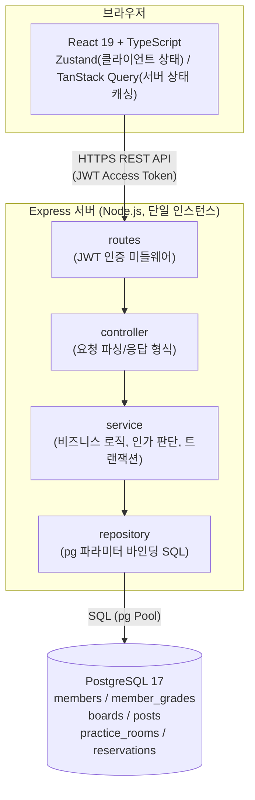
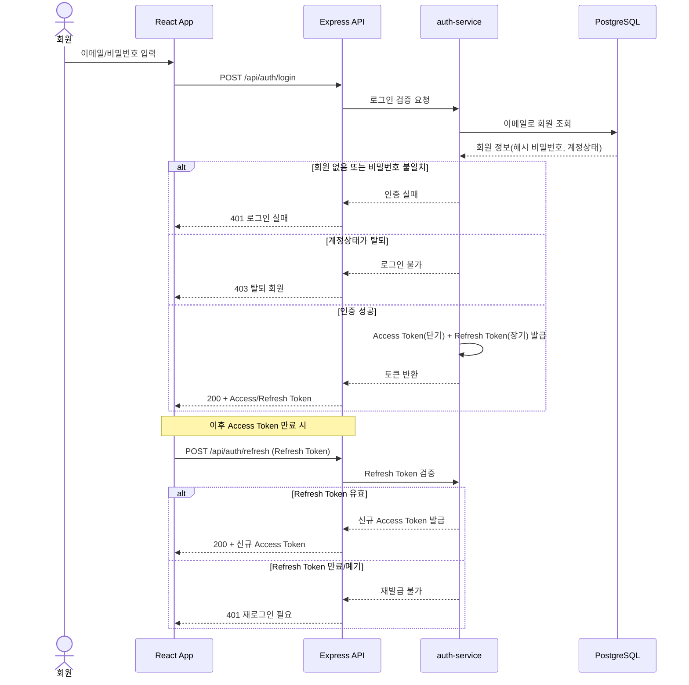
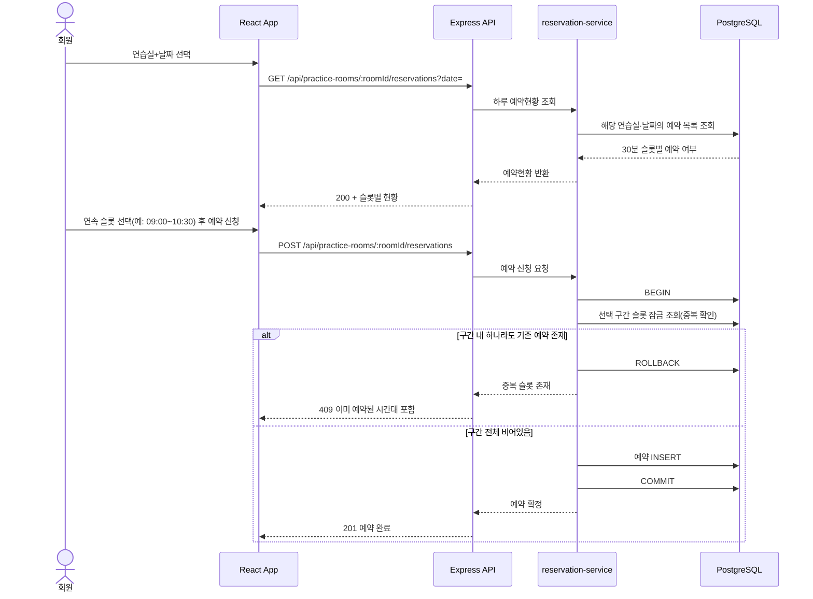

# 색연필 색소폰 동호회 홈페이지 - 기술 아키텍처 다이어그램

## 0. 문서 개요
본 문서는 도메인 정의서(`1-domain-definition.md`, v0.6), PRD(`2-PRD.md`, v0.7), 프로젝트 구조 설계 원칙(`5-project-principle.md`, v0.4), 데이터베이스 ERD(`7-erd.md`, v0.5)를 기반으로 시스템 전체 구조와 주요 비즈니스 로직 흐름을 Mermaid 다이어그램으로 표현한다.

## 변경 이력
| Version | Date | Changes | Author |
|---|---|---|---|
| 0.1 | 2026-09-09 | 최초 작성 | Kang SangSoo |
| 0.2 | 2026-09-09 | 0절 참조 문서 버전 표기 정정(프로젝트 구조 설계 원칙 v0.2→v0.3) 및 ERD(7-erd.md v0.3) 참조 추가 | Kang SangSoo |
| 0.3 | 2026-09-09 | 0절 참조 문서 버전 표기 정정(PRD v0.6→v0.7, 프로젝트 구조 설계 원칙 v0.3→v0.4, ERD v0.3→v0.5). 다이어그램 변경 없음 | Kang SangSoo |

## 1. 전체 시스템 구조

1인 개발·2일 일정, 회원 500명 이하·동시접속 20명 규모에 맞춰 단일 Express 서버 + 단일 PostgreSQL로 구성한다. 별도 캐시/메시지 큐/마이크로서비스는 두지 않는다.

프론트엔드는 TanStack Query로만 서버 데이터를 가져오고, 백엔드는 routes→controller→service→repository 순서로 단방향 의존한다.

## 2. 주요 비즈니스 로직 시퀀스 다이어그램

아래 3가지는 도메인 정의서/PRD상 여러 단계의 검증·조건 분기가 있는 로직으로, 단순 CRUD와 구분해 별도로 표현한다.

### 2.1 로그인 및 JWT Access/Refresh Token 발급·재발급 (F-02)

로그인 시 Access/Refresh Token을 함께 발급하고, Access Token 만료 시 Refresh Token으로 재발급받는 흐름이다.

### 2.2 연습실 예약 신청 - 연속 슬롯 중복 검증 (F-20, F-21)

하루 전체 예약현황 조회 후, 선택한 연속 30분 슬롯 구간에 중복이 있는지 트랜잭션으로 검증한다.

### 2.3 등급 기반 게시판 접근 제어 (F-10, F-11)

게시판 열람/게시글 작성 시 회원등급과 게시판의 "이용가능 최소등급"을 비교해 인가를 판단한다.

