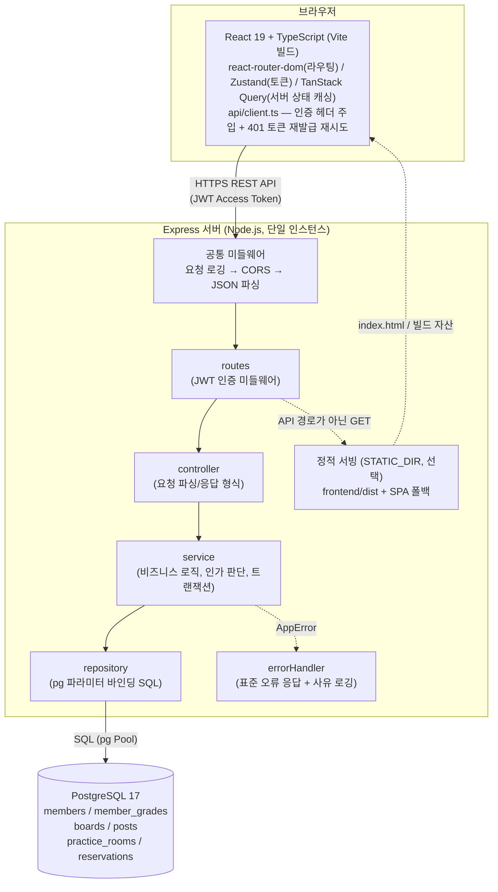
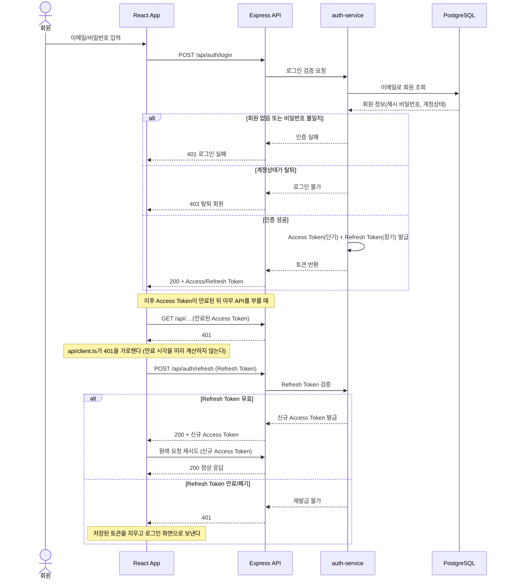
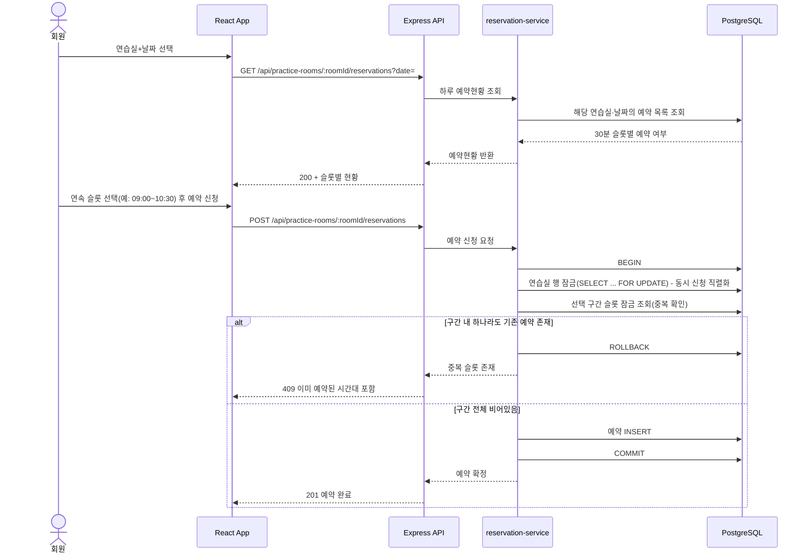
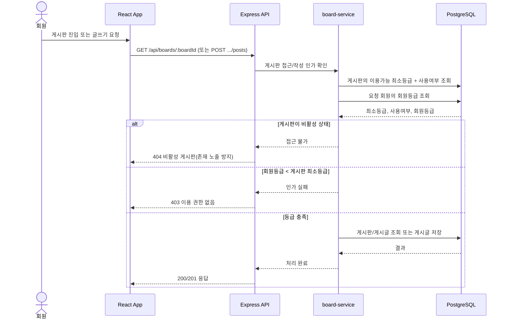

# 색연필 색소폰 동호회 홈페이지 - 기술 아키텍처 다이어그램

## 0. 문서 개요
본 문서는 도메인 정의서(`1-domain-definition.md`), PRD(`2-PRD.md`), 프로젝트 구조 설계 원칙(`5-project-principle.md`), 데이터베이스 ERD(`7-erd.md`)를 기반으로 시스템 전체 구조와 주요 비즈니스 로직 흐름을 Mermaid 다이어그램으로 표현한다.

## 변경 이력
| Version | Date | Changes | Author |
|---|---|---|---|
| 0.1 | 2026-09-09 | 최초 작성 | Kang SangSoo |
| 0.2 | 2026-09-09 | 0절 참조 문서 버전 표기 정정(프로젝트 구조 설계 원칙 v0.2→v0.3) 및 ERD(7-erd.md v0.3) 참조 추가 | Kang SangSoo |
| 0.3 | 2026-09-09 | 0절 참조 문서 버전 표기 정정(PRD v0.6→v0.7, 프로젝트 구조 설계 원칙 v0.3→v0.4, ERD v0.3→v0.5). 다이어그램 변경 없음 | Kang SangSoo |
| 0.4 | 2026-09-10 | 백엔드 구현 결과 반영: §2.2 예약 신청 시퀀스에 연습실 부모 행 잠금 단계 추가(ERD v0.6 §4의 팬텀 삽입 차단), §2.3 비활성 게시판 응답을 "404/403"에서 404로 확정. 0절 참조 문서 버전 표기 정정(프로젝트 구조 설계 원칙 v0.4→v0.5, ERD v0.5→v0.6) | Kang SangSoo |
| 0.5 | 2026-09-10 | 0절 참조 문서 버전 표기 정정(프로젝트 구조 설계 원칙 v0.5→v0.6, ERD v0.6→v0.7). 다이어그램 변경 없음 | Kang SangSoo |
| 0.6 | 2026-09-10 | 0절 참조 문서 버전 표기 정정(프로젝트 구조 설계 원칙 v0.6→v0.7, ERD v0.7→v0.8). 다이어그램 변경 없음 | Kang SangSoo |
| 0.7 | 2026-09-10 | 0절 참조에서 버전 표기 제거(프로젝트 구조 설계 원칙 §8 문서 관리 원칙 적용). 다이어그램 변경 없음 | Kang SangSoo |
| 0.8 | 2026-09-10 | 코드베이스 실측 결과 반영: §1 다이어그램에 실제 존재하는 공통 미들웨어(요청 로깅 → CORS → JSON 파싱)와 `errorHandler` 노드 추가. 종전 다이어그램은 요청이 곧바로 routes로 들어가는 것처럼 보였다. 미들웨어 등록 순서의 이유와 `/api-docs`·`/swagger.yaml`이 조건부로만 열린다는 설명도 본문에 추가 | Kang SangSoo |
| 0.10 | 2026-09-11 | §1 배포 형태에 **서버리스 + 관리형 DB(현재 운영 형태)** 추가. 레이어 구조는 같지만 정적 서빙 노드가 프로세스 밖으로 나가므로 SPA 폴백도 호스팅 설정으로 옮겨야 한다는 점을 명시했다 — 실제로 이 이동을 빠뜨려 배포본의 `/` 외 모든 경로가 404였다 | Kang SangSoo |
| 0.9 | 2026-09-10 | 프론트엔드 구현(FE-01~09)과 IT-02 대조 결과 반영: §1 클라이언트 노드에 실제 스택(Vite 빌드, react-router-dom, `api/client.ts`) 명시, `STATIC_DIR` 정적 서빙 노드와 배포 형태 2가지(단일 출처/출처 분리)·`VITE_API_BASE_URL` 빌드 시점 주입 설명 추가. §2.1 재발급 시퀀스를 실제 구현대로 정정 — 종전 다이어그램은 클라이언트가 만료를 스스로 알고 `refresh`를 부르는 것처럼 그려져 있었으나, 실제로는 401을 받은 뒤 재발급하고 원래 요청을 재시도하며 동시 401은 재발급 1회로 합친다 | Kang SangSoo |

## 1. 전체 시스템 구조

1인 개발·2일 일정, 회원 500명 이하·동시접속 20명 규모에 맞춰 단일 Express 서버 + 단일 PostgreSQL로 구성한다. 별도 캐시/메시지 큐/마이크로서비스는 두지 않는다.

프론트엔드는 TanStack Query로만 서버 데이터를 가져오고, 백엔드는 routes→controller→service→repository 순서로 단방향 의존한다. 프론트엔드의 모든 요청은 `api/client.ts` 한 곳을 지나며, 컴포넌트가 `fetch`를 직접 부르는 곳은 없다 — 토큰 주입과 재발급을 한 자리에 두기 위해서다.

**프론트엔드를 누가 내보내는가는 배포 형태에 따라 갈린다**(`backend/README.md` §배포).

- **단일 출처**: `STATIC_DIR=../frontend/dist`를 설정하면 위 다이어그램의 `정적 서빙`이 등록되어 Express가 빌드 결과와 API를 같은 출처로 함께 내보낸다. 프론트/API가 같은 출처이므로 `CORS_ORIGIN`이 필요 없다. 정적 서빙은 **API 라우터보다 뒤에** 등록되고, 폴백은 `/api/`로 시작하는 경로와 GET 이외의 메서드를 제외한다 — 없는 API에 `index.html`을 200으로 주면 클라이언트가 JSON을 파싱하다 깨진다.
- **출처 분리**: `STATIC_DIR`을 비우면 정적 서빙이 등록되지 않고 이 서버는 API만 담당한다. 개발 중에는 Vite 개발서버(5173)가, 운영에서 분리 배포하면 별도 정적 서버가 프론트를 담당하며, 이때는 `CORS_ORIGIN`에 그 출처를 넣어야 한다.
- **서버리스 + 관리형 DB (현재 운영 형태)**: 출처 분리의 변형이다. 프론트·백엔드를 각각 Vercel에, DB는 Supabase에 둔다. 위 다이어그램의 레이어 구조는 그대로지만 **정적 서빙 노드가 이 프로세스 밖(호스팅 계층)으로 나가므로, SPA 폴백도 호스팅 설정으로 옮겨야 한다**(`frontend/vercel.json`의 rewrite). 이 이동을 빠뜨리면 `/` 외 모든 주소가 404가 된다 — 단일 출처에서는 서버가 해주던 일이라 눈에 띄지 않는다. DB는 서버리스 특성상 트랜잭션 모드 풀러를 경유한다. 절차는 `backend/README.md` §배포 (다).

`VITE_API_BASE_URL`은 **빌드 시점에 결과물에 박힌다**. 단일 출처 배포에서는 이 값을 비운 채로 빌드해야 프론트가 자기 출처의 `/api/...`를 부른다.

공통 미들웨어는 라우터보다 앞에 등록되어 모든 요청을 지나간다. 요청 로깅이 가장 앞이라 CORS로 막힌 요청도 로그에 남고, CORS는 본문 파싱보다 앞이라 preflight(`OPTIONS`)가 라우터에 닿지 않고 204로 끝난다. `errorHandler`는 스택 맨 뒤에 있어 어느 레이어에서 던진 `AppError`든 같은 형식(`{code, message}`)으로 응답하며, 4xx는 사유만·5xx는 스택까지 로그에 남긴다. 이 서버는 `GET /health`로 DB 연결까지 확인하고 실패 시 503을 반환한다.

`ENABLE_API_DOCS=true`인 경우에만 `GET /api-docs`(Swagger UI)와 `GET /swagger.yaml`이 추가로 등록된다. API 소비자용 경로가 아니라 개발·운영 편의 기능이므로 위 다이어그램에는 넣지 않았다.

## 2. 주요 비즈니스 로직 시퀀스 다이어그램

아래 3가지는 도메인 정의서/PRD상 여러 단계의 검증·조건 분기가 있는 로직으로, 단순 CRUD와 구분해 별도로 표현한다.

### 2.1 로그인 및 JWT Access/Refresh Token 발급·재발급 (F-02)

로그인 시 Access/Refresh Token을 함께 발급하고, Access Token 만료 시 Refresh Token으로 재발급받는 흐름이다.

클라이언트 쪽 구현에서 갈린 사실 셋을 함께 적는다(`frontend/src/api/client.ts`).

- **만료를 미리 알지 않는다.** 토큰의 `exp`를 파싱해 선제적으로 재발급하지 않고, **401을 받은 뒤에** 재발급하고 원래 요청을 한 번 재시도한다. 시계 오차와 토큰 해석을 클라이언트가 떠안지 않기 위해서다. 재시도한 요청이 또 401이면 재발급으로 풀리는 문제가 아니므로 토큰을 지운다.
- **동시에 여러 요청이 401을 받아도 재발급은 한 번만 보낸다.** 화면 하나가 쿼리 3개를 동시에 던지는 일이 흔한데, 그때마다 재발급하면 나중 응답이 앞선 응답의 토큰을 덮어써 방금 받은 토큰이 무효가 된다. 진행 중인 재발급 Promise를 공유한다.
- **로그인·회원가입·재발급 요청은 이 재시도에서 제외한다.** 이들의 401은 "토큰이 만료됐다"가 아니라 "비밀번호가 틀렸다"는 뜻이고, 재발급 요청 자체에 걸면 무한 재귀가 된다.

### 2.2 연습실 예약 신청 - 연속 슬롯 중복 검증 (F-20, F-21)

하루 전체 예약현황 조회 후, 선택한 연속 30분 슬롯 구간에 중복이 있는지 트랜잭션으로 검증한다.

### 2.3 등급 기반 게시판 접근 제어 (F-10, F-11)

게시판 열람/게시글 작성 시 회원등급과 게시판의 "이용가능 최소등급"을 비교해 인가를 판단한다.

