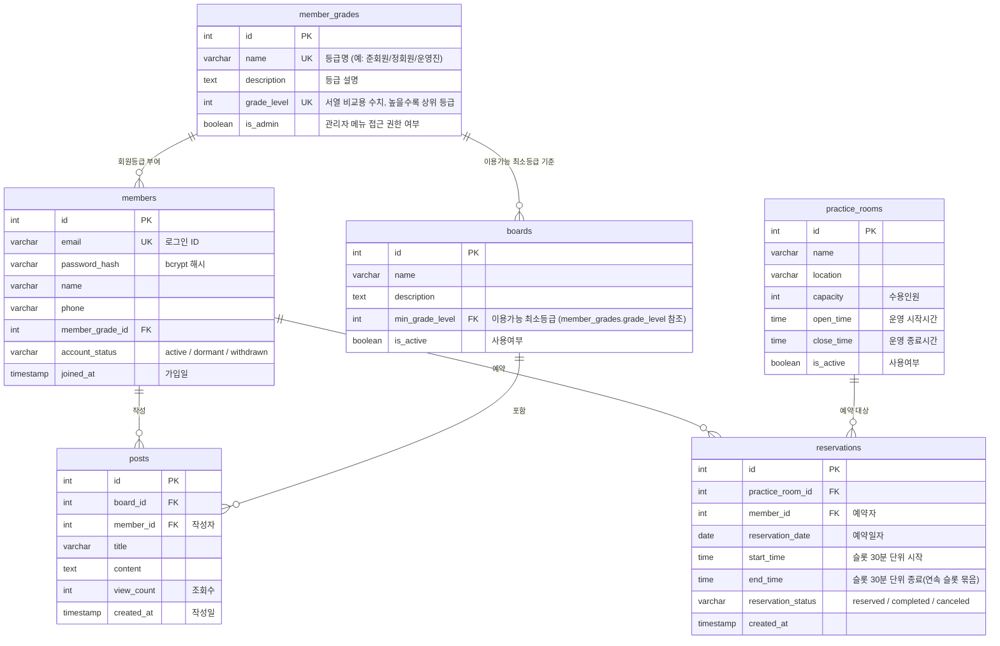

# 색연필 색소폰 동호회 홈페이지 - 데이터베이스 ERD

## 변경 이력
| Version | Date | Changes | Author |
|---|---|---|---|
| 0.1 | 2026-09-09 | 최초 작성 | Kang SangSoo |
| 0.2 | 2026-09-09 | 예약 중복 방어용 제약을 일반 UNIQUE → 부분 유니크 인덱스(`WHERE reservation_status = 'reserved'`)로 정정 (취소된 예약이 있는 시간대의 재예약을 막던 오류 해소, 사용자 시나리오 S-06과 정합) | Kang SangSoo |
| 0.3 | 2026-09-09 | §1 프로젝트 구조 설계 원칙 참조 버전 표기(v0.2→v0.3) 정정, §4에 Refresh Token 미저장(무상태) 설계 결정 명시(PRD F-02 "로그아웃 시 폐기"에 대한 스키마 차원 설명 누락 보완) | Kang SangSoo |
| 0.4 | 2026-09-09 | 실행 DDL(`docs/schema.sql`) 작성에 따라 §1에 DDL 파일 참조 및 시각 컬럼 타입(TIMESTAMPTZ / DATE·TIME) 명시, §4의 30분 단위 검증에 DB CHECK 제약 보조 방어선 추가 | Kang SangSoo |
| 0.5 | 2026-09-09 | §1 프로젝트 구조 설계 원칙 참조 버전 표기(v0.3→v0.4) 정정, §3 제약조건 표에 `schema.sql`이 구현한 제약 누락분 반영(`members.account_status` DEFAULT `active`, `posts.view_count` CHECK ≥ 0, `reservations` 시간 순서 CHECK `start_time < end_time` 및 30분 경계 CHECK) | Kang SangSoo |
| 0.6 | 2026-09-10 | 백엔드 구현(BE-08·BE-10)에서 드러난 설계 사실 반영: §3·§4에 `boards.min_grade_level` FK의 `ON UPDATE NO ACTION` 성질과 그로부터 파생되는 "참조 중인 등급서열은 변경 불가(409)" 규칙 명시, §4 예약 중복 방지에 `practice_rooms` 부모 행 잠금(팬텀 삽입 차단) 추가. §1 프로젝트 구조 설계 원칙 참조 버전 표기(v0.4→v0.5) 정정 | Kang SangSoo |
| 0.7 | 2026-09-10 | §1 프로젝트 구조 설계 원칙 참조 버전 표기(v0.5→v0.6) 정정. 데이터 모델 변경 없음 | Kang SangSoo |
| 0.8 | 2026-09-10 | §1 프로젝트 구조 설계 원칙 참조 버전 표기(v0.6→v0.7) 정정. 데이터 모델 변경 없음 | Kang SangSoo |
| 0.9 | 2026-09-10 | §1 참조에서 버전 표기 제거(프로젝트 구조 설계 원칙 §8 문서 관리 원칙 적용). 데이터 모델 변경 없음 | Kang SangSoo |

## 1. 문서 개요
도메인 정의서(1-domain-definition.md)와 프로젝트 구조 설계 원칙(5-project-principle.md)을 기반으로, PostgreSQL 17에 순수 SQL(CREATE TABLE)로 바로 옮길 수 있는 물리 데이터 모델을 정의한다.

본 ERD를 실행 가능한 DDL로 옮긴 결과는 `docs/schema.sql`이다. 스키마를 변경할 때는 이 문서와 `schema.sql`을 함께 갱신한다. 기록 시각 컬럼(`joined_at`, `created_at`)은 DDL에서 `TIMESTAMPTZ`로 구현하며, 예약 시각(`reservation_date`/`start_time`/`end_time`)은 벽시계 기준이므로 `DATE`/`TIME`을 사용한다.

## 2. ERD

## 3. 테이블 설명

| 테이블 | 목적 | 주요 제약조건 | 최소 인덱스 |
|---|---|---|---|
| `member_grades` | 회원 등급 체계 관리. "관리자"는 별도 액터가 아니라 `is_admin = true`인 최상위 등급으로 표현 | `name` UNIQUE, `grade_level` UNIQUE·NOT NULL(서열 비교 및 boards FK 대상) | PK 인덱스로 충분 |
| `members` | 회원 계정 정보 | `email` UNIQUE·NOT NULL, `password_hash` NOT NULL(평문 저장 금지), `account_status` NOT NULL DEFAULT 'active' + CHECK IN ('active','dormant','withdrawn'), `member_grade_id` FK → `member_grades(id)` ON DELETE RESTRICT(사용 중인 등급 삭제 방지) | `email` 유니크 인덱스(로그인 조회) |
| `boards` | 게시판 정의, 등급별 접근 제한 | `min_grade_level` FK → `member_grades(grade_level)` ON DELETE RESTRICT(ON UPDATE는 지정하지 않아 `NO ACTION` — §4 참고), `is_active` NOT NULL DEFAULT true | PK 인덱스로 충분(게시판 수가 적음) |
| `posts` | 게시판별 게시글 | `board_id` FK → `boards(id)` ON DELETE RESTRICT, `member_id` FK → `members(id)` ON DELETE RESTRICT(탈퇴 회원 게시글 보존), `view_count` NOT NULL DEFAULT 0 + CHECK >= 0 | `(board_id, created_at)` 목록 조회용, `member_id` |
| `practice_rooms` | 예약 대상 연습실 | `capacity` CHECK > 0, `open_time < close_time`, `is_active` NOT NULL DEFAULT true | PK 인덱스로 충분(연습실 수가 적음) |
| `reservations` | 연습실 예약(연속 30분 슬롯을 하나의 시작~종료 구간으로 저장) | `practice_room_id` FK → `practice_rooms(id)` ON DELETE RESTRICT, `member_id` FK → `members(id)` ON DELETE RESTRICT(탈퇴 회원 예약 이력 보존), `reservation_status` NOT NULL DEFAULT 'reserved' + CHECK IN ('reserved','completed','canceled'), 시간 순서 CHECK `start_time < end_time`, 30분 경계 CHECK(`start_time`/`end_time`의 분이 0 또는 30, 초가 0), 부분 유니크 인덱스 `(practice_room_id, reservation_date, start_time) WHERE reservation_status = 'reserved'`(유효 예약에 한해 동일 슬롯 시작점 중복 신청 차단) | `(practice_room_id, reservation_date)` 예약 현황 조회용, `member_id` |

## 4. 주요 설계 결정 사항

- **예약 중복 방지는 애플리케이션 트랜잭션에서 처리한다.** 연속 슬롯 구간(시작~종료)의 겹침 여부는 단순 UNIQUE 제약만으로 표현할 수 없어(범위 겹침 판정 필요), `reservation-service`에서 `BEGIN` → 같은 연습실·날짜의 기존 예약을 `SELECT ... FOR UPDATE`로 잠그고 구간 겹침을 검사 → `INSERT` → `COMMIT` 순으로 원자적으로 처리한다(project-principle §2.2와 일치). 단, **기존 예약 행만 잠그는 것으로는 부족하다** — `SELECT ... FOR UPDATE`는 행 잠금이지 술어(predicate) 잠금이 아니어서 "아직 존재하지 않는 행"을 막지 못한다. 빈 구간에 두 트랜잭션이 동시에 들어오면 잠글 행이 없어 양쪽 모두 겹침 검사를 통과하고 둘 다 INSERT 된다(팬텀 삽입). 그래서 검사 전에 **항상 존재하는 부모 행인 `practice_rooms`의 해당 연습실 행을 `SELECT ... FOR UPDATE`로 먼저 잠가** 같은 연습실에 대한 예약 신청을 직렬화한다. 보조 방어선으로는 **부분 유니크 인덱스**를 둔다: `CREATE UNIQUE INDEX ON reservations (practice_room_id, reservation_date, start_time) WHERE reservation_status = 'reserved'`. 일반 UNIQUE 제약을 쓰면 취소된(`canceled`) 예약이 남아 있는 시간대를 다시 예약할 수 없게 되어 "취소된 예약은 이력에 남되 시간대는 재예약 가능"(사용자 시나리오 S-06) 규칙과 충돌하므로, 유효한 예약(`reserved`)에만 적용되도록 조건을 붙인다.
- **탈퇴 회원 이력 보존을 위해 `posts.member_id`, `reservations.member_id`는 `ON DELETE RESTRICT`로 설정**했다. 회원 탈퇴는 `members.account_status = 'withdrawn'`로 표현되는 소프트 삭제이며 회원 행 자체를 삭제하지 않으므로, 게시글/예약은 그대로 남고 탈퇴 회원은 서비스 로직(로그인/글쓰기/예약 차단)에서만 제한된다. `RESTRICT`는 실수로 회원 행을 하드 삭제해 이력이 유실되는 것을 막기 위한 안전장치다.
- **등급 서열 비교는 `member_grades.grade_level`(정수, UNIQUE)로 처리**한다. 게시판은 `boards.min_grade_level`을 `member_grades.grade_level`을 참조하는 FK로 두어, "회원등급 : 게시판 = 1:N" 관계(도메인 정의서 §3)를 DB 차원에서 보장하면서 서비스 코드에서는 `member.grade_level >= board.min_grade_level` 형태의 단순 정수 비교만으로 접근 제어를 수행할 수 있다.
- **게시판이 참조 중인 `grade_level` 값은 변경할 수 없다.** 위 FK에 `ON UPDATE`를 지정하지 않았으므로 PostgreSQL 기본값인 `NO ACTION`이 적용되어, 어떤 게시판이 참조하는 `member_grades.grade_level`을 다른 값으로 바꾸면 FK 위반(`23503`)이 발생한다. 기본 시드의 게시판 4건이 서열 10/20/30을 모두 참조하므로 이는 초기 상태에서 곧바로 재현되는 조건이다. 따라서 등급 수정 API(F-30)는 `grade_level` 재배치 요청을 받으면 **DB 오류를 그대로 500으로 흘리지 않고, 해당 서열을 참조하는 게시판 수를 먼저 세어 1건 이상이면 409로 거부**한다. 서열을 옮기려면 그 서열을 쓰는 게시판의 최소등급을 먼저 다른 값으로 바꿔야 한다. `ON UPDATE CASCADE`를 택하지 않은 이유는, 서열 값 하나를 고치면 게시판의 접근 정책이 조용히 함께 바뀌어 인가 기준이 의도치 않게 이동하기 때문이다 — 실패하게 두고 관리자가 순서대로 처리하는 편이 안전하다.
- **관리자는 별도 테이블 없이 `member_grades.is_admin` 플래그로 표현**했다. 도메인 정의서 §2.2가 "관리자는 별도 액터가 아니라 최상위 등급"이라고 명시하므로, 별도 role/actor 테이블을 두지 않고 등급 자체에 관리자 여부를 붙이는 것이 요구사항에 가장 가깝고 단순하다.
- **예약 30분 단위는 별도 슬롯 테이블 없이 `start_time`/`end_time` 구간으로 표현**한다. 슬롯 단위 테이블을 따로 두면 예약 1건이 여러 행으로 나뉘어 조회/취소 로직이 복잡해지므로(오버엔지니어링), 연속 슬롯을 하나의 예약 행(시작~종료)으로 저장한다. 30분 단위 검증은 서비스 레이어 입력 검증에서 처리하고, DB에도 보조 방어선으로 CHECK 제약(`분`이 0 또는 30, `초`가 0)을 둔다.
- **Refresh Token은 별도 테이블에 저장하지 않는다.** PRD F-02의 "로그아웃 시 Refresh Token 폐기"는 서버 측 토큰 저장소 없이 클라이언트 토큰 삭제 + 만료(`JWT_REFRESH_EXPIRES_IN`) 기준으로 처리한다. 동시접속 20명 규모에서 즉시 무효화 요구가 없으므로 토큰 화이트/블랙리스트 테이블은 두지 않는다(project-principle §1 "규모에 맞는 결정").
- **자료실, 로그, 알림, 첨부파일 등은 테이블로 만들지 않았다.** 도메인 정의서 §2가 정의한 6개 엔티티(회원/회원등급/게시판/게시글/연습실/예약) 범위만 반영했으며, 자료실은 명시적으로 범위 제외되었다(도메인 정의서 §1, 변경이력 v0.2).
