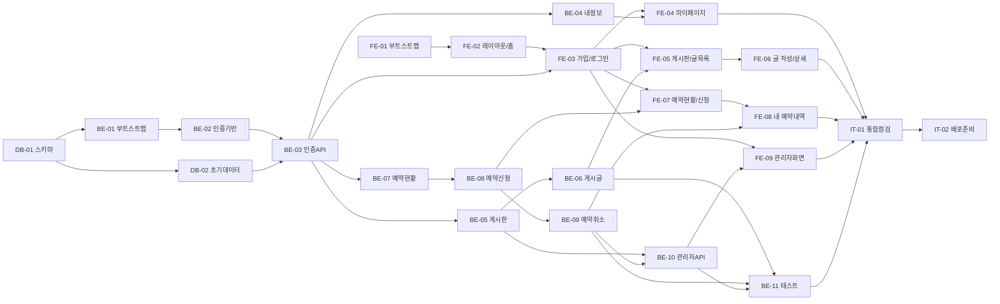

# 색연필 색소폰 동호회 홈페이지 - 작업 실행 계획 (WBS)

## 변경 이력
| Version | Date | Changes | Author |
|---|---|---|---|
| 0.1 | 2026-09-09 | 최초 작성 | Kang SangSoo |
| 0.2 | 2026-09-09 | §0 참조 문서 버전 표기 정정(사용자 시나리오 v0.6→v0.7, 와이어프레임 v0.6→v0.7, 프로젝트 구조 설계 원칙 v0.3→v0.4, 아키텍처 다이어그램 v0.2→v0.3, ERD v0.4→v0.5), IT-01 선행 Task 목록에 누락된 FE-07 반영(§2 표기 "FE-04~FE-09"와 일치) | Kang SangSoo |
| 0.3 | 2026-09-09 | BE-10 수행작업에 관리자용 게시판·연습실 목록 조회(`GET`, 비활성 포함) 누락분 반영(와이어프레임 13·14번과 FE-09가 요구하는 비활성 항목 목록을 일반 회원용 `GET /api/boards`·`GET /api/practice-rooms`로는 조회할 수 없던 문제 해소) 및 관련 완료 조건 추가, BE-10 완료 조건의 "참조 중인 등급 삭제" 항목 제거(등급 삭제는 PRD F-30 범위(생성/수정) 밖이며 해당 API·화면이 없음) | Kang SangSoo |

## 0. 문서 개요
본 문서는 docs 디렉토리의 기획·설계 문서(도메인 정의서 v0.6, PRD v0.7, 사용자 시나리오 v0.7, 와이어프레임 v0.7, 프로젝트 구조 설계 원칙 v0.4, 아키텍처 다이어그램 v0.3, ERD v0.5, `schema.sql`)를 근거로 실제 구현 작업을 데이터베이스·백엔드·프론트엔드 단위의 독립 Task로 분해한 실행 계획이다.

## 1. 계획 수립 기준

- **범위**: PRD §4의 **P0 기능**(F-01~03, F-10~12, F-20~22, F-30~32)을 2일 내 완성 대상으로 한다. P1(F-04 계정상태 자동전이, F-23 예약 자동완료)은 §7 백로그로 분리한다.
- **제외**: 자료실(도메인 정의서 v0.2에서 범위 제외), 네이티브 앱, 알림/결제, 접근성 대응(PRD §3 Out of Scope).
- **리소스**: 1인 개발, 2일.
- **Task 분해 원칙**: 각 Task는 독립적으로 착수·완료·검증이 가능한 단위로 나누되, 레이어 원칙(routes→controller→service→repository)에 따라 하나의 기능(F-ID)을 세로로 관통해 완성한다. 레이어별 가로 분해(예: "모든 controller 작성")는 중간 산출물이 검증 불가하므로 하지 않는다.
- **Task ID**: `DB-nn`(데이터베이스), `BE-nn`(백엔드), `FE-nn`(프론트엔드), `IT-nn`(통합/마무리).

## 2. Task 분해 개요

| ID | 작업명 | 관련 F-ID / 화면 | 예상 | 선행 Task |
|---|---|---|---|---|
| DB-01 | 데이터베이스 생성 및 스키마 적용 | ERD 전체 | 0.5h | - |
| DB-02 | 개발용 초기 데이터 구성 | ERD 전체 | 0.5h | DB-01 |
| BE-01 | 백엔드 프로젝트 부트스트랩 | - | 0.5h | DB-01 |
| BE-02 | 인증 기반 공통 모듈 (JWT·해시·미들웨어) | F-02 | 1.0h | BE-01 |
| BE-03 | 회원가입·로그인·로그아웃·토큰 재발급 API | F-01, F-02 | 1.5h | BE-02, DB-02 |
| BE-04 | 본인 정보 조회·수정 API | F-03 | 0.5h | BE-03 |
| BE-05 | 게시판 목록·상세 API (등급 인가) | F-10 | 1.0h | BE-03 |
| BE-06 | 게시글 목록·상세·작성·수정·삭제 API | F-11, F-12 | 1.5h | BE-05 |
| BE-07 | 연습실 목록·하루 예약현황 조회 API | F-20 | 1.0h | BE-03 |
| BE-08 | 예약 신청 API (연속 슬롯 중복 검증) | F-21 | 1.5h | BE-07 |
| BE-09 | 내 예약 내역·예약 취소 API | F-22 | 1.0h | BE-08 |
| BE-10 | 관리자 API (회원등급·게시판·연습실 관리) | F-30, F-31, F-32 | 2.0h | BE-05, BE-09 |
| BE-11 | P0 핵심 로직 자동화 테스트 | - | 1.0h | BE-06, BE-09, BE-10 |
| FE-01 | 프론트엔드 프로젝트 부트스트랩 | - | 0.5h | - |
| FE-02 | 공통 레이아웃·반응형 네비게이션·홈 화면 | 화면 2 | 1.0h | FE-01 |
| FE-03 | 회원가입·로그인 화면 및 인증 연동 | 화면 3, 4 | 1.5h | FE-02, BE-03 |
| FE-04 | 마이페이지(본인 정보 수정) 화면 | 화면 5 | 0.5h | FE-03, BE-04 |
| FE-05 | 게시판 목록·게시글 목록 화면 | 화면 6, 7 | 1.5h | FE-03, BE-06 |
| FE-06 | 게시글 작성·상세·수정·삭제 화면 | 화면 8 | 1.0h | FE-05 |
| FE-07 | 연습실 예약현황·예약 신청 화면 | 화면 9, 10 | 2.0h | FE-03, BE-08 |
| FE-08 | 내 예약 내역 화면 (필터·취소) | 화면 11 | 1.0h | FE-07, BE-09 |
| FE-09 | 관리자 화면 3종 | 화면 12, 13, 14 | 2.0h | FE-03, BE-10 |
| IT-01 | 통합 점검 (P0 시나리오 E2E 수동 확인) | S-01~S-08 | 1.0h | FE-04~FE-09, BE-11 |
| IT-02 | 배포 준비 (환경변수·CORS·헬스체크) | - | 0.5h | IT-01 |

**P0 합계 예상: 약 26h** — 2일(약 16h) 대비 초과하므로 §6의 조정 방안을 함께 적용한다.

## 3. Task 의존 관계

---

## 4. Task 상세

### DB-01. 데이터베이스 생성 및 스키마 적용
- **선행 Task**: 없음
- **수행 작업**
  - PostgreSQL 17 인스턴스에 개발용 데이터베이스 생성
  - `docs/schema.sql` 실행으로 6개 테이블·인덱스·초기 등급 데이터 생성
  - 접속 정보를 백엔드 `.env` 항목(`DATABASE_URL` 또는 `PG*`)으로 정리
- **완료 조건**
  - [ ] `psql -d <db> -f docs/schema.sql` 이 오류 없이 완료된다
  - [ ] `members`, `member_grades`, `boards`, `posts`, `practice_rooms`, `reservations` 6개 테이블이 존재한다
  - [ ] `member_grades`에 준회원/정회원/운영진 3건이 조회된다
  - [ ] `reservations`의 부분 유니크 인덱스(`uq_reservations_active_slot`)가 생성되어 있다

### DB-02. 개발용 초기 데이터 구성
- **선행 Task**: DB-01
- **수행 작업**
  - 게시판 3~4건 등록(전체 공개/정회원 이상/운영진 전용, 비활성 1건 포함)
  - 연습실 2건 등록(운영시간·수용인원 포함, 비활성 1건 포함)
  - 관리자 계정 1건 및 등급별 테스트 회원 2~3건 생성(비밀번호는 해시값으로 삽입)
- **완료 조건**
  - [ ] 등급별 접근 제어를 검증할 수 있는 게시판이 최소 3건 존재한다(최소등급 서로 다름)
  - [ ] 예약 검증에 사용할 활성 연습실이 최소 1건 존재한다
  - [ ] `is_admin = true` 등급을 가진 관리자 계정으로 로그인 검증이 가능하다
  - [ ] 준회원 등급 테스트 회원이 존재해 등급 미달 차단 검증이 가능하다

### BE-01. 백엔드 프로젝트 부트스트랩
- **선행 Task**: DB-01
- **수행 작업**
  - `backend/` 생성, Express·pg·bcrypt·jsonwebtoken·dotenv 설치
  - 프로젝트 구조 원칙 §7의 디렉토리 골격 생성(`routes`/`controllers`/`services`/`repositories`/`middlewares`/`db`/`utils`)
  - `db/pool.js`(pg Pool), `app.js`, `server.js`, `middlewares/errorHandler.js` 작성
  - `.env`, `.env.example` 작성(`DATABASE_URL`, `JWT_*`, `PORT`), `.gitignore`에 `.env` 등록
- **완료 조건**
  - [ ] `npm start`로 서버가 지정 포트에서 기동된다
  - [ ] `GET /health`가 200과 DB 연결 성공 여부를 응답한다
  - [ ] `.env.example`에 키 이름만 있고 실제 시크릿 값은 저장소에 없다
  - [ ] 예외 발생 시 errorHandler를 통해 일관된 JSON 오류 형식으로 응답한다

### BE-02. 인증 기반 공통 모듈
- **선행 Task**: BE-01
- **수행 작업**
  - `utils/jwt.js`: Access/Refresh Token 발급·검증(시크릿·유효기간은 환경변수에서 로드)
  - `utils/password.js`: bcrypt 해시·비교
  - `middlewares/auth.js`: Access Token 검증 후 회원ID·등급 정보를 요청 컨텍스트에 주입(로그인 여부까지만 판단)
- **완료 조건**
  - [ ] 토큰 시크릿·유효기간이 코드에 하드코딩되어 있지 않다(환경변수 참조)
  - [ ] 유효한 Access Token으로 보호된 라우트 접근이 통과한다
  - [ ] 만료·위조 토큰은 401로 거부된다
  - [ ] 인가(등급·소유권) 판단 로직이 미들웨어에 포함되지 않았다(service 책임, 원칙 §2.2)

### BE-03. 회원가입·로그인·로그아웃·토큰 재발급 API (F-01, F-02)
- **선행 Task**: BE-02, DB-02
- **수행 작업**
  - `POST /api/auth/signup`: 필수값·이메일 형식 검증, 이메일 중복 확인, 비밀번호 해시 저장, 기본 등급(최저 `grade_level`) 부여
  - `POST /api/auth/login`: 자격 검증 후 Access·Refresh Token 발급, 탈퇴(`withdrawn`) 계정 차단
  - `POST /api/auth/refresh`: Refresh Token 검증 후 Access Token 재발급
  - `POST /api/auth/logout`: 클라이언트 토큰 폐기 기준 처리(서버 측 토큰 저장소 없음 - ERD §4)
- **완료 조건**
  - [ ] 신규 가입 시 기본 등급이 자동 부여되고 비밀번호가 해시로 저장된다(평문 없음)
  - [ ] 중복 이메일 가입이 409(또는 400)로 거부된다
  - [ ] 로그인 성공 시 Access·Refresh Token이 함께 반환된다
  - [ ] 비밀번호 불일치는 401, 탈퇴 계정은 403으로 거부된다
  - [ ] 만료된 Access Token + 유효한 Refresh Token으로 재발급이 성공한다
  - [ ] 만료·위조 Refresh Token은 401로 거부된다

### BE-04. 본인 정보 조회·수정 API (F-03)
- **선행 Task**: BE-03
- **수행 작업**
  - `GET /api/members/me`: 본인 정보(이름·연락처·등급명·가입일) 조회
  - `PATCH /api/members/me`: 이름·연락처만 수정 허용, 이메일·등급·계정상태는 수정 대상에서 제외
- **완료 조건**
  - [ ] 로그인 회원이 본인 정보를 조회할 수 있다
  - [ ] 이름·연락처 수정이 저장되고 재조회 시 반영된다
  - [ ] 이메일·회원등급·계정상태 변경 요청은 무시되거나 400으로 거부된다
  - [ ] 비로그인 요청은 401로 거부된다

### BE-05. 게시판 목록·상세 API (F-10)
- **선행 Task**: BE-03
- **수행 작업**
  - `GET /api/boards`: 활성 게시판 목록과 각 게시판의 최소등급, 요청 회원의 접근 가능 여부 반환
  - `GET /api/boards/:boardId`: service 레이어에서 `회원.grade_level >= 게시판.min_grade_level` 및 `is_active` 검증
- **완료 조건**
  - [ ] 등급 충족 게시판은 정상 조회된다
  - [ ] 등급 미달 게시판 진입은 403으로 거부된다
  - [ ] 비활성 게시판은 일반 회원 목록에 노출되지 않고 직접 접근도 거부된다
  - [ ] 인가 판단이 service 레이어에서 수행된다(원칙 §2.2)

### BE-06. 게시글 목록·상세·작성·수정·삭제 API (F-11, F-12)
- **선행 Task**: BE-05
- **수행 작업**
  - `GET /api/boards/:boardId/posts`: 페이지네이션 목록(제목·작성자·작성일·조회수)
  - `GET /api/posts/:postId`: 상세 조회 및 조회수 증가
  - `POST /api/boards/:boardId/posts`: 등급 검증 후 작성
  - `PATCH`/`DELETE /api/posts/:postId`: 작성자 본인 또는 관리자(`is_admin`)만 허용
  - 모든 게시판 접근 시 BE-05의 등급 인가 재사용
- **완료 조건**
  - [ ] 게시글 목록이 페이지네이션과 함께 반환된다
  - [ ] 상세 조회 시 조회수가 1 증가한다
  - [ ] 등급 미달 회원의 작성 요청이 403으로 거부된다
  - [ ] 타인 게시글 수정·삭제 요청이 403으로 거부된다
  - [ ] 작성자 본인과 관리자는 수정·삭제가 성공한다

### BE-07. 연습실 목록·하루 예약현황 조회 API (F-20)
- **선행 Task**: BE-03
- **수행 작업**
  - `GET /api/practice-rooms`: 활성 연습실 목록(운영시간·수용인원 포함)
  - `GET /api/practice-rooms/:roomId/reservations?date=YYYY-MM-DD`: 운영시간 전체를 30분 단위 슬롯으로 전개하고 각 슬롯의 예약 여부(예약자 표시 포함) 반환
  - 취소된(`canceled`) 예약은 점유로 계산하지 않음
- **완료 조건**
  - [ ] 운영시간 09:00~22:00 기준 30분 슬롯이 빠짐없이 반환된다
  - [ ] 기존 예약이 걸친 모든 슬롯이 "예약불가"로 표시된다
  - [ ] 취소 상태 예약의 시간대는 "예약가능"으로 표시된다
  - [ ] 비활성 연습실은 목록에서 제외된다
  - [ ] 운영시간 외 시간대는 응답에 포함되지 않는다

### BE-08. 예약 신청 API (F-21)
- **선행 Task**: BE-07
- **수행 작업**
  - `POST /api/practice-rooms/:roomId/reservations`: 시작·종료 시각 수신
  - 입력 검증: 30분 경계, `start_time < end_time`, 운영시간 내, 연속 구간 여부
  - service 트랜잭션: `BEGIN` → 동일 연습실·날짜 예약을 `SELECT ... FOR UPDATE`로 잠금 → 구간 겹침 검사 → `INSERT` → `COMMIT`(겹침 시 `ROLLBACK` + 409)
- **완료 조건**
  - [ ] 비어 있는 연속 슬롯 구간(예: 09:00~10:30) 예약이 201로 확정된다
  - [ ] 구간 내 슬롯이 하나라도 겹치면 409로 거부되고 부분 저장이 발생하지 않는다
  - [ ] 30분 경계를 벗어난 시각(예: 09:17)은 400으로 거부된다
  - [ ] 운영시간을 벗어난 요청은 400으로 거부된다
  - [ ] 비활성 연습실·탈퇴 회원의 예약 요청이 거부된다

### BE-09. 내 예약 내역·예약 취소 API (F-22)
- **선행 Task**: BE-08
- **수행 작업**
  - `GET /api/members/me/reservations?roomId=`: 본인 예약 목록, 연습실별 필터 지원
  - `PATCH /api/reservations/:reservationId/cancel`: 본인 예약 + 시작 시각 이전만 취소 허용, 관리자는 시작 여부 무관 허용(도메인 정의서 §6)
- **완료 조건**
  - [ ] 본인 예약 내역이 상태(예약/완료/취소)와 함께 조회된다
  - [ ] `roomId` 필터 적용 시 해당 연습실 예약만 반환되고, 미지정 시 전체가 반환된다
  - [ ] 시작 전 본인 예약 취소가 성공하고 상태가 `canceled`로 변경된다
  - [ ] 이미 시작된 예약의 일반 회원 취소 요청이 403(또는 400)으로 거부된다
  - [ ] 타인 예약 취소 요청이 403으로 거부된다
  - [ ] 관리자는 시작 여부와 무관하게 취소할 수 있다
  - [ ] 취소된 시간대가 다시 예약 가능 상태로 조회된다(BE-07 연계)

### BE-10. 관리자 API (F-30, F-31, F-32)
- **선행 Task**: BE-05, BE-09
- **수행 작업**
  - 회원등급: `GET /api/admin/members`(검색), `PATCH /api/admin/members/:id/grade`, 등급 체계 `GET`/`POST`/`PATCH`
  - 게시판: `GET`(비활성 포함 전체 목록)/`POST`/`PATCH`/`DELETE /api/admin/boards`(최소등급·사용여부 설정)
  - 연습실: `GET`(비활성 포함 전체 목록)/`POST`/`PATCH`/`DELETE /api/admin/practice-rooms`(운영시간·수용인원·사용여부), 예약 현황·내역 조회 및 강제 취소
  - 모든 관리자 엔드포인트는 service 레이어에서 `is_admin` 검증
- **완료 조건**
  - [ ] 관리자 계정으로 회원 등급 변경이 성공하고 변경 후 게시판 접근 권한이 달라진다
  - [ ] 게시판 생성·수정(최소등급·사용여부)이 반영되고 F-10 접근 제어에 즉시 적용된다
  - [ ] 연습실 등록·수정·사용여부 변경이 반영된다
  - [ ] 관리자가 임의 예약을 강제 취소할 수 있다
  - [ ] 비관리자 계정의 모든 관리자 엔드포인트 접근이 403으로 거부된다
  - [ ] 비활성 게시판·연습실이 관리자 목록에는 표시되고 일반 회원 목록에는 표시되지 않는다
  - [ ] 참조 중인 게시판·연습실 삭제 시 FK RESTRICT로 인한 오류가 500이 아닌 의미 있는 4xx로 응답된다

### BE-11. P0 핵심 로직 자동화 테스트
- **선행 Task**: BE-06, BE-09, BE-10
- **수행 작업**
  - 프로젝트 구조 원칙 §4의 4개 항목에 대해 service 레이어 테스트 작성(각 성공 1 + 실패 1)
    - 인증: 토큰 발급/재발급, 만료 토큰 거부
    - 등급 기반 게시판 접근 제어
    - 예약 중복 방지(연속 슬롯 정상 / 겹침 거부)
    - 소유권 검사(게시글·예약)
- **완료 조건**
  - [ ] 테스트 러너 단일 명령(`npm test`)으로 전체 테스트가 실행된다
  - [ ] 4개 항목 각각 성공·실패 케이스가 모두 통과한다
  - [ ] 테스트가 개발 DB 데이터를 오염시키지 않는다(별도 DB 또는 트랜잭션 롤백)

### FE-01. 프론트엔드 프로젝트 부트스트랩
- **선행 Task**: 없음
- **수행 작업**
  - Vite + React 19 + TypeScript 프로젝트 생성, Zustand·TanStack Query·라우터 설치
  - 프로젝트 구조 원칙 §6 디렉토리 골격 생성(`pages`/`components`/`features`/`api`/`types`/`lib`)
  - `api/client.ts`: 인증 헤더 주입 + Access Token 만료 시 Refresh 재발급 인터셉터
  - `features/auth/authStore.ts`: Zustand로 로그인 사용자·토큰 관리(서버 데이터 이중 저장 금지)
  - `types/`에 도메인 타입 정의(Member, MemberGrade, Board, Post, PracticeRoom, Reservation)
- **완료 조건**
  - [ ] `npm run dev`로 개발 서버가 기동되고 초기 화면이 렌더링된다
  - [ ] TanStack Query Provider와 라우터가 앱 루트에 적용되어 있다
  - [ ] 도메인 타입 필드명이 ERD 컬럼·용어 매핑표(원칙 §3)와 일치한다
  - [ ] 컴포넌트에서 `fetch`를 직접 호출하지 않고 `api/client.ts`를 경유한다

### FE-02. 공통 레이아웃·반응형 네비게이션·홈 화면 (화면 2)
- **선행 Task**: FE-01
- **수행 작업**
  - 상단 메뉴바(게시판/연습실예약/마이페이지/로그인·로그아웃, 관리자 등급이면 [관리자] 추가)
  - 좁은 화면에서 햄버거(≡) 메뉴로 축소되는 반응형 처리
  - 홈 화면: 환영 문구 + 게시판·연습실예약 바로가기
- **완료 조건**
  - [ ] PC 폭에서 첫 화면 상단에 메뉴바로 전체 메뉴가 노출된다
  - [ ] 모바일 폭에서 메뉴가 햄버거 메뉴로 축소되고 펼침·접힘이 동작한다
  - [ ] 비로그인 시 "로그인", 로그인 시 "로그아웃"이 표시된다
  - [ ] 관리자 등급 계정에만 [관리자] 메뉴가 노출된다
  - [ ] 페이지 본문이 좌우로 스크롤되지 않는다(모바일 폭 기준)

### FE-03. 회원가입·로그인 화면 및 인증 연동 (화면 3, 4)
- **선행 Task**: FE-02, BE-03
- **수행 작업**
  - 회원가입 폼(이름·이메일·비밀번호·비밀번호확인·연락처) + 인라인 검증
  - 로그인 폼 및 토큰 저장, 로그인 후 홈(또는 이전 경로) 이동
  - 비로그인 상태에서 보호된 경로 접근 시 로그인 화면으로 리다이렉트
  - 로그아웃 처리(클라이언트 토큰 폐기)
- **완료 조건**
  - [ ] 회원가입 성공 후 로그인까지 이어지는 흐름이 동작한다(S-01)
  - [ ] 이메일 중복·비밀번호 불일치 등 서버 오류가 화면에 안내 메시지로 표시된다
  - [ ] 로그인 후 새로고침해도 로그인 상태가 유지된다
  - [ ] Access Token 만료 시 Refresh로 자동 재발급되어 요청이 재개된다
  - [ ] 비로그인 상태로 보호 경로 접근 시 로그인 화면으로 이동한다
  - [ ] 로그아웃 후 보호 경로 접근이 차단된다

### FE-04. 마이페이지(본인 정보 수정) 화면 (화면 5)
- **선행 Task**: FE-03, BE-04
- **수행 작업**
  - 이메일(읽기 전용)·회원등급(읽기 전용)·가입일 표시, 이름·연락처 입력 필드
  - 저장 시 검증 및 성공·실패 피드백
- **완료 조건**
  - [ ] 본인 정보가 화면에 정확히 표시된다
  - [ ] 이메일·회원등급 필드가 수정 불가로 표시된다
  - [ ] 이름·연락처 수정 후 저장하면 재조회 시에도 반영되어 있다(S-02)
  - [ ] 필수값 누락·형식 오류 시 저장이 차단되고 안내가 표시된다

### FE-05. 게시판 목록·게시글 목록 화면 (화면 6, 7)
- **선행 Task**: FE-03, BE-06
- **수행 작업**
  - 게시판 목록: 최소등급 표시, 접근 불가 게시판은 잠금 아이콘·비활성 처리, 내 등급 표시
  - 게시글 목록: 표(PC) / 카드 리스트(모바일) 전환, 페이지네이션, 등급 충족 시에만 글쓰기 버튼 노출
- **완료 조건**
  - [ ] 내 등급으로 접근 가능한 게시판과 불가한 게시판이 시각적으로 구분된다(S-03)
  - [ ] 접근 불가 게시판 클릭 시 권한 없음 안내가 표시된다
  - [ ] 게시글 목록에 제목·작성자·작성일·조회수가 표시되고 페이지 이동이 동작한다
  - [ ] 모바일 폭에서 표가 카드 리스트로 전환된다
  - [ ] 작성 권한이 없는 회원에게 글쓰기 버튼이 노출되지 않는다

### FE-06. 게시글 작성·상세·수정·삭제 화면 (화면 8)
- **선행 Task**: FE-05
- **수행 작업**
  - 작성 화면(제목·내용), 상세 화면(본문·작성정보·조회수)
  - 작성자 본인 또는 관리자에게만 수정·삭제 버튼 노출, 삭제 확인 처리
  - 수정·삭제·작성 후 목록 캐시 무효화(TanStack Query invalidate)
- **완료 조건**
  - [ ] 게시글 작성 후 목록에 즉시 반영된다
  - [ ] 상세 화면에 본문·작성자·작성일·조회수가 표시된다
  - [ ] 타인 게시글에는 수정·삭제 버튼이 노출되지 않는다(S-04)
  - [ ] 본인 게시글 수정·삭제가 정상 동작하고 목록이 갱신된다

### FE-07. 연습실 예약현황·예약 신청 화면 (화면 9, 10)
- **선행 Task**: FE-03, BE-08
- **수행 작업**
  - 연습실·날짜 선택 후 하루 전체 30분 슬롯 현황 표시(예약가능/예약불가)
  - 빈 슬롯 다중 선택 + **연속 슬롯만 허용**하는 선택 로직(비연속 선택 시 안내)
  - 선택 요약(시작~종료, 슬롯 수) 표시 후 예약 신청 화면으로 이동, 확정 처리
  - PC는 목록형, 모바일은 카드형 + 하단 선택 요약 배치
- **완료 조건**
  - [ ] 연습실·날짜 선택 시 하루 전체 30분 슬롯이 표시된다(S-05)
  - [ ] 예약된 슬롯은 선택할 수 없고 예약자 정보가 표시된다
  - [ ] 연속 슬롯 다중 선택이 동작하고 선택 요약(시작~종료·슬롯 수)이 정확하다
  - [ ] 비연속 슬롯 선택 시 안내가 표시되고 예약이 진행되지 않는다
  - [ ] 예약 확정 시 성공 안내 후 현황이 갱신된다
  - [ ] 서버가 409(중복)로 거부하면 "이미 예약된 시간대 포함" 안내가 표시된다
  - [ ] 모바일 폭에서 카드형 레이아웃과 하단 요약이 정상 표시된다

### FE-08. 내 예약 내역 화면 (화면 11)
- **선행 Task**: FE-07, BE-09
- **수행 작업**
  - 예약 목록(연습실·날짜·시간대·상태), PC 표 / 모바일 카드 전환
  - 상단 연습실 필터 드롭다운(기본값 "전체")
  - 시작 전 `reserved` 건에만 취소 버튼 노출, 취소 후 목록·예약현황 캐시 무효화
- **완료 조건**
  - [ ] 본인 예약이 상태(예약/완료/취소)와 함께 표시된다
  - [ ] 연습실 필터 선택 시 해당 연습실 예약만 표시되고 "전체"로 초기화된다(S-06)
  - [ ] 시작 전 예약에만 취소 버튼이 노출된다
  - [ ] 취소 성공 후 상태가 "취소"로 갱신되고 해당 시간대가 예약현황에서 다시 예약가능으로 표시된다
  - [ ] 모바일 폭에서 카드 리스트로 전환된다

### FE-09. 관리자 화면 3종 (화면 12, 13, 14)
- **선행 Task**: FE-03, BE-10
- **수행 작업**
  - 회원 등급 관리: 회원 검색·목록, 등급 드롭다운 변경·저장, 등급 체계 관리 영역
  - 게시판 관리: 목록(최소등급·사용여부), 생성·수정 폼(게시판명·설명·최소등급·사용여부), 삭제
  - 연습실 관리: 목록·생성·수정(위치·수용인원·운영시간·사용여부), 예약 현황·내역 조회 및 강제 취소
  - 관리자 등급이 아닌 사용자의 라우트 접근 차단
- **완료 조건**
  - [ ] 관리자가 회원 등급을 변경하면 대상 회원의 게시판 접근 권한이 달라진다(S-07)
  - [ ] 게시판 생성·수정(최소등급·사용여부)이 저장되고 일반 회원 화면에 반영된다(S-08)
  - [ ] 연습실 등록·수정·사용여부 변경이 저장되고 예약 화면에 반영된다
  - [ ] 관리자가 예약을 강제 취소할 수 있다
  - [ ] 비관리자 계정이 관리자 경로에 접근하면 차단된다

### IT-01. 통합 점검 (P0 시나리오 수동 확인)
- **선행 Task**: FE-04, FE-05, FE-06, FE-07, FE-08, FE-09, BE-11
- **수행 작업**
  - 사용자 시나리오 S-01~S-08을 실제 브라우저에서 순차 실행
  - PC 폭·모바일 폭(개발자도구 기준) 양쪽에서 주요 화면 확인
  - 발견 결함 목록화 후 P0 영향 항목만 우선 수정
- **완료 조건**
  - [ ] S-01~S-08 전 시나리오가 브라우저에서 성공적으로 재현된다
  - [ ] 등급 미달 접근·중복 예약·시작 후 취소 등 거부 케이스가 의도대로 차단된다
  - [ ] PC/모바일 폭 모두에서 주요 화면 레이아웃이 깨지지 않는다
  - [ ] 콘솔에 처리되지 않은 오류(uncaught error)가 없다
  - [ ] P0 기능을 막는 결함이 남아 있지 않다

### IT-02. 배포 준비
- **선행 Task**: IT-01
- **수행 작업**
  - 운영용 환경변수 정리(`JWT_*`, `DATABASE_URL`, `PORT`, CORS 허용 origin)
  - 프론트엔드 프로덕션 빌드 및 정적 서빙 경로 확인
  - `GET /health` 기반 기동 확인, 단일 서버 실행 절차를 README에 정리
- **완료 조건**
  - [ ] `.env.example`이 실제 필요한 키를 모두 포함하고 시크릿 값은 비어 있다
  - [ ] 프론트엔드 프로덕션 빌드가 오류 없이 완료된다
  - [ ] 운영 환경에서 CORS 허용 origin이 환경변수로 주입된다
  - [ ] README에 DB 생성 → 스키마 적용 → 백엔드 기동 → 프론트 빌드 순서가 정리되어 있다

---

## 5. 2일 실행 순서

| 구분 | 시간대 | Task |
|---|---|---|
| Day 1 오전 | 4h | DB-01, DB-02, BE-01, BE-02, BE-03, FE-01 |
| Day 1 오후 | 4h | BE-05, BE-06, BE-07, FE-02, FE-03 |
| Day 2 오전 | 4h | BE-08, BE-09, BE-04, FE-05, FE-07 |
| Day 2 오후 | 4h | BE-10, FE-06, FE-08, FE-09, FE-04, BE-11, IT-01, IT-02 |

- 백엔드 엔드포인트를 먼저 열고 해당 화면을 곧바로 붙이는 순서를 유지해, 매 구간 끝에 동작하는 기능이 남도록 한다.
- 각 Task 완료 시 완료 조건 체크박스를 채우고, 미충족 항목은 즉시 다음 Task로 넘기지 않는다.

## 6. 일정 리스크 및 조정 방안

P0 전체 예상(약 26h)이 가용 시간(약 16h)을 초과한다. 아래 순서로 축소해 **동작하는 MVP**를 우선 확보한다.

1. **BE-11(자동화 테스트) 축소**: 4개 항목 중 예약 중복 방지·등급 접근 제어 2개만 자동화하고 나머지는 IT-01의 수동 확인으로 대체.
2. **FE-09(관리자 화면) 최소화**: 등급 변경·게시판 생성/수정·연습실 등록/수정만 구현하고, 삭제·등급 체계 관리·강제 취소는 백엔드 API만 남기고 화면은 후순위.
3. **게시글 페이지네이션 단순화**: 무한스크롤·페이지 번호 대신 최신 N건 조회로 축소.
4. **FE-04(마이페이지) 후순위**: 인증·게시판·예약이 먼저 동작해야 하므로 마지막에 배치.
5. 그래도 초과하면 **관리자 기능(F-30~32)을 Day 3로 이월**한다. 관리자 기능 없이도 DB-02의 초기 데이터로 일반 회원 시나리오(S-01~S-06) 검증이 가능하다.

축소 결정은 도메인 정의서·PRD의 **비즈니스 규칙 검증(중복 예약 금지, 등급 접근 제어, 취소 제약)** 보다 우선하지 않는다. 즉 위 규칙 관련 로직은 어떤 경우에도 구현·검증 대상에서 제외하지 않는다.

## 7. P1 백로그 (MVP 이후)

| ID | 작업명 | 관련 F-ID | 비고 |
|---|---|---|---|
| BL-01 | 계정상태 자동 전이(휴면/탈퇴) 배치 | F-04 | MVP에서는 관리자 수동 처리로 대체 |
| BL-02 | 예약 상태 자동 완료 전환 배치 | F-23 | 조회 시점 계산으로 임시 대체 가능 |
| BL-03 | 관리자 화면 잔여 기능(삭제·등급 체계 관리·강제 취소 UI) | F-30~32 | §6에서 축소한 경우에만 발생 |
| BL-04 | 게시글 페이지네이션 고도화 | F-11 | §6에서 축소한 경우에만 발생 |
