# 색연필 색소폰 동호회 홈페이지 — E2E 통합테스트 리포트 (모바일)

- 실행 시각: 2026. 9. 11. 오전 10:53:35
- 뷰포트: 393×851 (Pixel 5, 터치)
- 대상: 프론트엔드 http://localhost:5174 / 백엔드 http://localhost:3001 (개발서버, 개발 DB `clubhome`)
- 도구: Playwright 1.63.0 (Chromium)
- 근거 시나리오: `docs/3-user-scenario.md` S-01~S-08, 반응형 규칙은 `docs/4-wireframes.md` §1

**54건 중 통과 54 · 실패 0 · 건너뜀 0**

## 요약

| 시나리오 | 테스트 | 결과 | 소요 |
|---|---|---|---|
| S-01 회원가입·로그인 | 홈 화면이 비로그인 상태로 열린다 | 통과 | 0.6s |
| S-01 회원가입·로그인 | 가입 후 그 계정으로 로그인한다 | 통과 | 1.5s |
| S-01 회원가입·로그인 | [엣지] 이미 가입된 이메일은 거부된다 | 통과 | 0.8s |
| S-01 회원가입·로그인 | [엣지] 비밀번호 확인이 다르면 서버에 보내지 않는다 | 통과 | 0.7s |
| S-01 회원가입·로그인 | [엣지] 비밀번호가 틀리면 로그인이 거부된다 | 통과 | 0.7s |
| S-01 회원가입·로그인 | [엣지] 로그인 없이 보호된 화면에 가면 로그인 화면으로 보낸다 | 통과 | 0.6s |
| S-01 회원가입·로그인 | 로그아웃하면 비로그인 상태로 돌아간다 | 통과 | 0.9s |
| S-02 본인 정보 수정 | 이름·연락처를 수정하고, 이메일은 수정할 수 없다 | 통과 | 1.3s |
| S-02 본인 정보 수정 | [엣지] 필수 항목을 비우면 저장이 거부된다 | 통과 | 1.0s |
| S-03 등급별 게시판 접근 | 준회원에게는 상위 게시판이 잠금으로 보인다 | 통과 | 1.0s |
| S-03 등급별 게시판 접근 | [엣지] 등급 미달 게시판에 들어가면 서버가 거부한다 | 통과 | 1.0s |
| S-03 등급별 게시판 접근 | 정회원은 정회원 게시판에 들어갈 수 있다 | 통과 | 1.0s |
| S-04 게시글 작성·수정·삭제 | 글을 쓰면 목록과 상세에 나타난다 | 통과 | 1.4s |
| S-04 게시글 작성·수정·삭제 | 본인 글을 수정한다 | 통과 | 1.2s |
| S-04 게시글 작성·수정·삭제 | [엣지] 타인의 글에는 수정·삭제 버튼이 없다 | 통과 | 1.2s |
| S-04 게시글 작성·수정·삭제 | 본인 글을 삭제하면 목록에서 사라진다 | 통과 | 1.3s |
| S-04 게시글 작성·수정·삭제 | [엣지] 없는 글을 열면 오류를 안내한다 | 통과 | 0.9s |
| S-04 게시글 작성·수정·삭제 | [엣지] 없는 경로는 404 화면을 보여준다 | 통과 | 0.6s |
| S-05 예약현황 조회·신청 | 하루 예약현황이 30분 단위로 표시된다 | 통과 | 1.0s |
| S-05 예약현황 조회·신청 | 연속된 슬롯을 골라 예약한다 | 통과 | 1.5s |
| S-05 예약현황 조회·신청 | [엣지] 비연속 슬롯을 고르면 안내하고 선택을 막는다 | 통과 | 1.1s |
| S-05 예약현황 조회·신청 | [엣지] 가운데 슬롯은 해제할 수 없다 | 통과 | 1.4s |
| S-05 예약현황 조회·신청 | [엣지] 이미 예약된 시간대는 고를 수 없다 | 통과 | 1.0s |
| S-05 예약현황 조회·신청 | [엣지] 화면이 낡아 이미 찬 구간을 신청하면 서버가 409로 거부한다 | 통과 | 1.9s |
| S-06 예약 취소 | 시작 전 예약을 취소하면 상태가 취소로 바뀐다 | 통과 | 1.7s |
| S-06 예약 취소 | 연습실 필터로 예약을 걸러낸다 | 통과 | 0.9s |
| S-06 예약 취소 | [엣지] 이미 시작된 예약에는 취소 버튼이 없다 | 통과 | 1.6s |
| S-07 회원 등급 변경 | 관리자에게만 [관리자] 메뉴가 보인다 | 통과 | 0.9s |
| S-07 회원 등급 변경 | 회원을 검색해 등급을 바꾼다 | 통과 | 1.3s |
| S-07 회원 등급 변경 | 등급 체계가 서열 순으로 보인다 | 통과 | 1.2s |
| S-07 회원 등급 변경 | [엣지] 비관리자는 관리자 화면에 들어갈 수 없다 | 통과 | 0.9s |
| S-08 게시판·연습실 관리 | 게시판 목록에 비활성 게시판까지 보인다 | 통과 | 1.0s |
| S-08 게시판·연습실 관리 | 게시판을 생성하고 다시 삭제한다 | 통과 | 1.4s |
| S-08 게시판·연습실 관리 | [엣지] 게시글이 있는 게시판은 삭제가 거부된다 | 통과 | 2.0s |
| S-08 게시판·연습실 관리 | 연습실 관리 화면에서 예약 현황까지 본다 | 통과 | 1.2s |
| S-08 게시판·연습실 관리 | 관리자가 예약을 강제 취소한다 | 통과 | 1.7s |
| 모바일 - 공통 네비게이션 | 메뉴가 햄버거로 접히고 눌러서 펼친다 | 통과 | 1.4s |
| 모바일 - 공통 네비게이션 | 관리자 메뉴도 시트 안에 들어간다 | 통과 | 1.0s |
| 모바일 - 표에서 카드로 전환 | 게시글 목록이 카드 리스트로 보인다 | 통과 | 1.4s |
| 모바일 - 표에서 카드로 전환 | 내 예약 내역이 카드 리스트로 보인다 | 통과 | 1.2s |
| 모바일 - 표에서 카드로 전환 | 예약현황의 선택 요약이 화면 하단에 붙어 따라온다 | 통과 | 1.2s |
| 모바일 - 레이아웃 넘침 | 홈 화면에 가로 스크롤이 없다 | 통과 | 0.9s |
| 모바일 - 레이아웃 넘침 | 로그인 화면에 가로 스크롤이 없다 | 통과 | 0.8s |
| 모바일 - 레이아웃 넘침 | 회원가입 화면에 가로 스크롤이 없다 | 통과 | 0.9s |
| 모바일 - 레이아웃 넘침 | 마이페이지 화면에 가로 스크롤이 없다 | 통과 | 0.8s |
| 모바일 - 레이아웃 넘침 | 게시판 목록 화면에 가로 스크롤이 없다 | 통과 | 0.9s |
| 모바일 - 레이아웃 넘침 | 연습실 예약현황 화면에 가로 스크롤이 없다 | 통과 | 0.9s |
| 모바일 - 레이아웃 넘침 | 내 예약 내역 화면에 가로 스크롤이 없다 | 통과 | 0.9s |
| 모바일 - 레이아웃 넘침 | 관리자 화면은 가로 스크롤을 자체 영역 안에서 처리한다 | 통과 | 1.2s |
| 모바일 - 주요 화면과 엣지케이스 | 폼 화면은 1열 그대로다 | 통과 | 0.8s |
| 모바일 - 주요 화면과 엣지케이스 | 게시판 목록의 잠금 표시가 모바일에서도 읽힌다 | 통과 | 1.0s |
| 모바일 - 주요 화면과 엣지케이스 | [엣지] 등급 미달 게시판 거부 안내가 모바일에서도 보인다 | 통과 | 1.1s |
| 모바일 - 주요 화면과 엣지케이스 | [엣지] 비연속 슬롯 안내가 모바일에서도 보인다 | 통과 | 1.2s |
| 모바일 - 주요 화면과 엣지케이스 | [엣지] 모바일에서도 관리자 경로는 비관리자를 막는다 | 통과 | 0.9s |

## 화면 캡처

시나리오 진행 순서대로 싣는다. `[엣지]`가 붙은 것은 거부·오류 경로다.

### S-01 회원가입·로그인 — 홈 화면이 비로그인 상태로 열린다 (통과)

**홈 화면(비로그인) — 메뉴에 "로그인"이 노출된다**

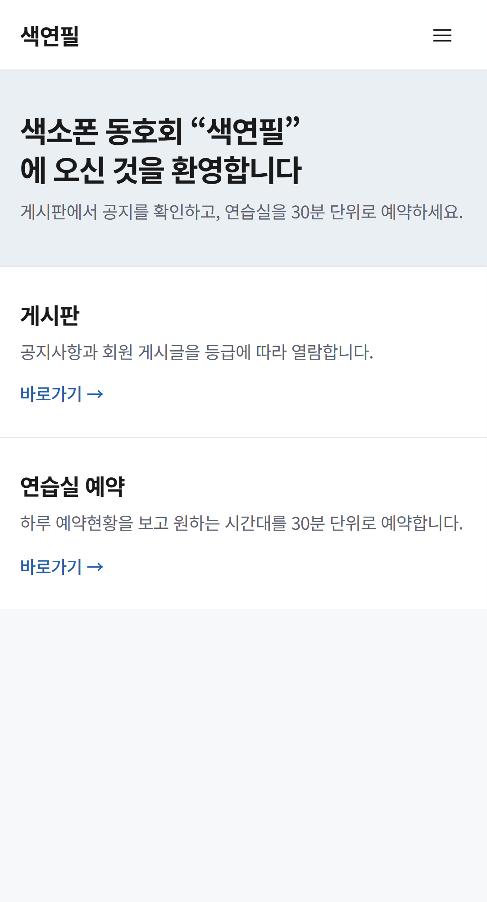

### S-01 회원가입·로그인 — 가입 후 그 계정으로 로그인한다 (통과)

**회원가입 폼 입력 완료**

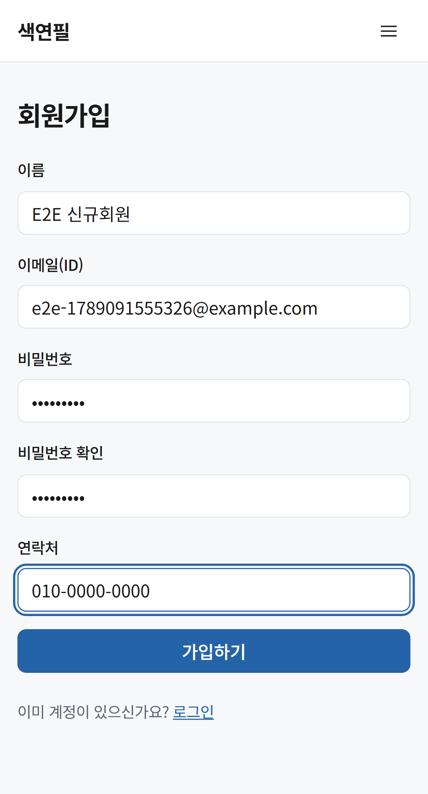

**가입 성공 후 로그인 화면으로 이동**

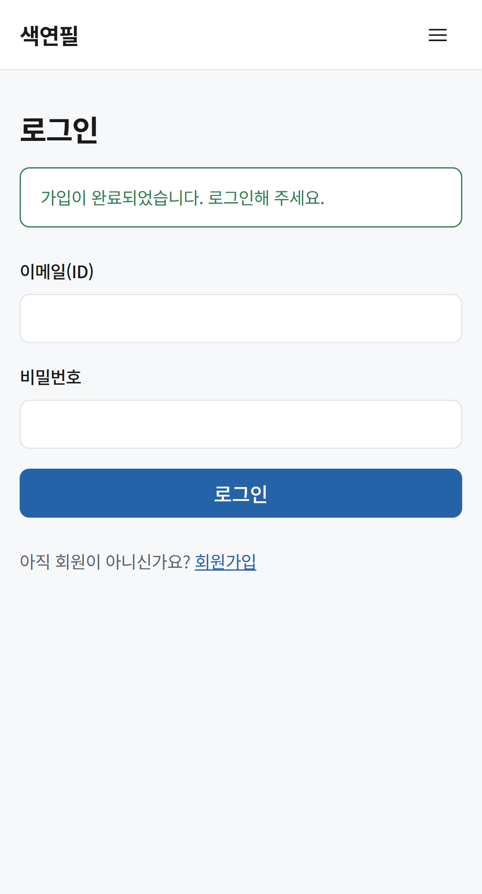

**로그인 성공 — 메뉴가 "로그아웃"으로 바뀐다**

**신규 회원에게 기본 등급(준회원)이 부여된다**

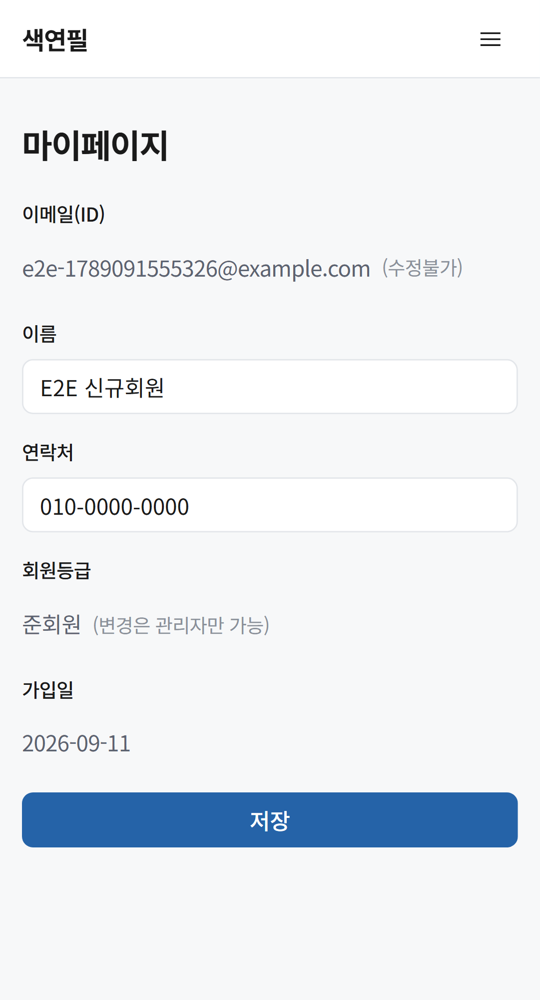

### S-01 회원가입·로그인 — [엣지] 이미 가입된 이메일은 거부된다 (통과)

**[엣지] 이메일 중복 가입 거부**

![[엣지] 이메일 중복 가입 거부](./screenshots/06-signup-duplicate.png)

### S-01 회원가입·로그인 — [엣지] 비밀번호 확인이 다르면 서버에 보내지 않는다 (통과)

**[엣지] 비밀번호 확인 불일치 — 클라이언트에서 차단**

![[엣지] 비밀번호 확인 불일치 — 클라이언트에서 차단](./screenshots/07-signup-mismatch.png)

### S-01 회원가입·로그인 — [엣지] 비밀번호가 틀리면 로그인이 거부된다 (통과)

**[엣지] 비밀번호 불일치 — 로그인 실패**

![[엣지] 비밀번호 불일치 — 로그인 실패](./screenshots/08-login-failed.png)

### S-01 회원가입·로그인 — [엣지] 로그인 없이 보호된 화면에 가면 로그인 화면으로 보낸다 (통과)

**[엣지] 비로그인 접근 차단 — 로그인 화면으로 이동**

![[엣지] 비로그인 접근 차단 — 로그인 화면으로 이동](./screenshots/09-guard-redirect.png)

### S-01 회원가입·로그인 — 로그아웃하면 비로그인 상태로 돌아간다 (통과)

**로그아웃 후 비로그인 상태**

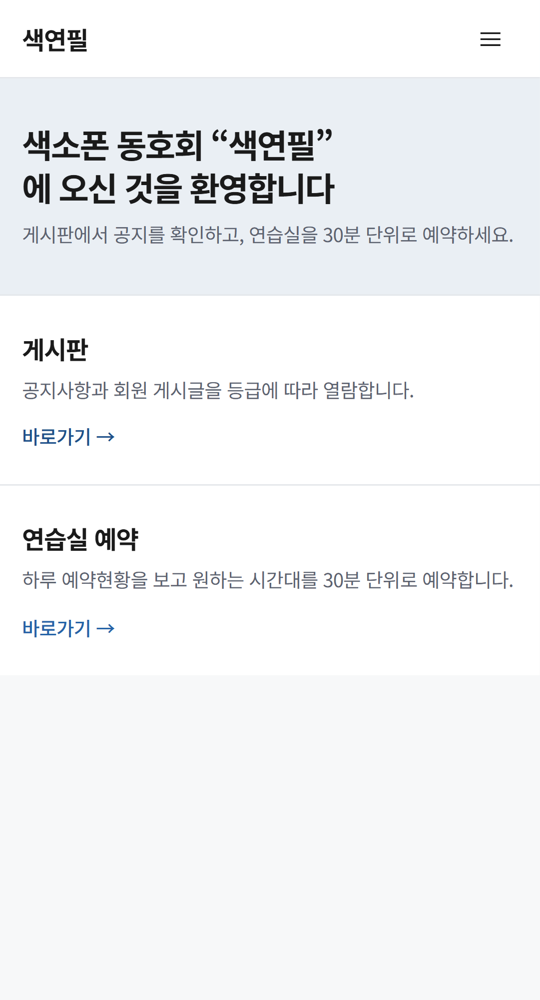

### S-02 본인 정보 수정 — 이름·연락처를 수정하고, 이메일은 수정할 수 없다 (통과)

**마이페이지 — 이메일·등급·가입일은 읽기 전용**

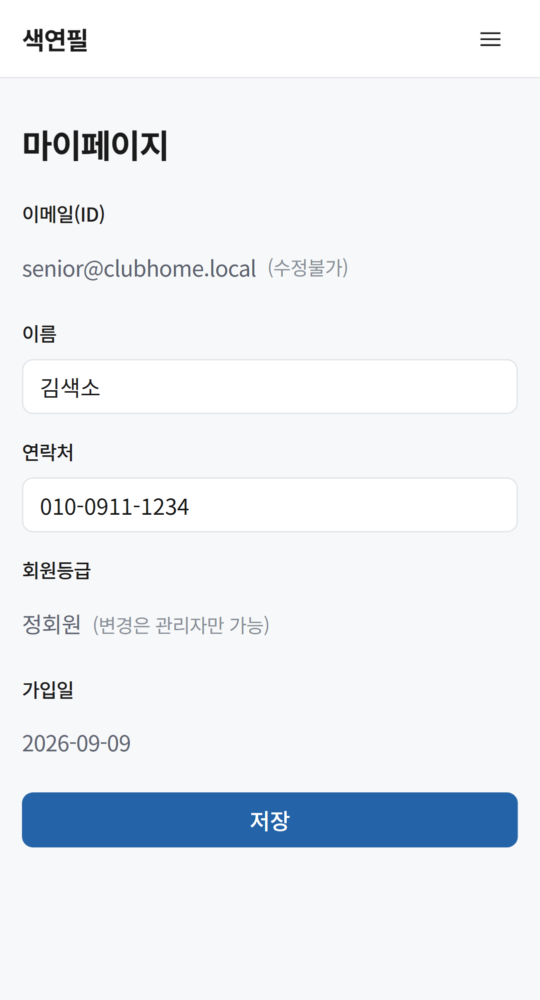

**본인 정보 수정 저장 성공**

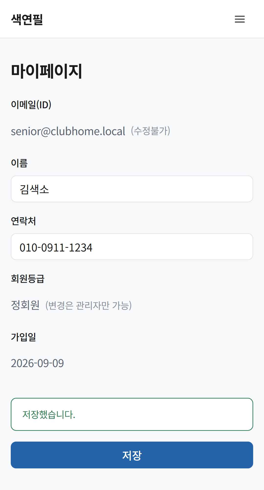

### S-02 본인 정보 수정 — [엣지] 필수 항목을 비우면 저장이 거부된다 (통과)

**[엣지] 이름 미입력 — 저장 거부**

![[엣지] 이름 미입력 — 저장 거부](./screenshots/13-mypage-required.png)

### S-03 등급별 게시판 접근 — 준회원에게는 상위 게시판이 잠금으로 보인다 (통과)

**S-03 게시판 목록(준회원) — 상위 게시판은 자물쇠와 "접근불가" 표기**

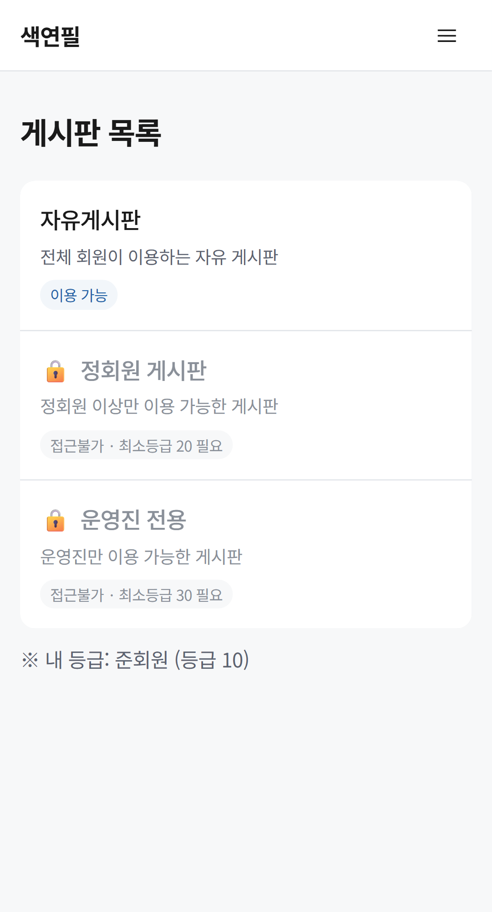

### S-03 등급별 게시판 접근 — [엣지] 등급 미달 게시판에 들어가면 서버가 거부한다 (통과)

**[엣지] 등급 미달 게시판 진입 — 서버 403 문구를 그대로 노출**

![[엣지] 등급 미달 게시판 진입 — 서버 403 문구를 그대로 노출](./screenshots/21-board-forbidden.png)

### S-03 등급별 게시판 접근 — 정회원은 정회원 게시판에 들어갈 수 있다 (통과)

**S-03 등급 충족 — 정회원 게시판 진입 성공**

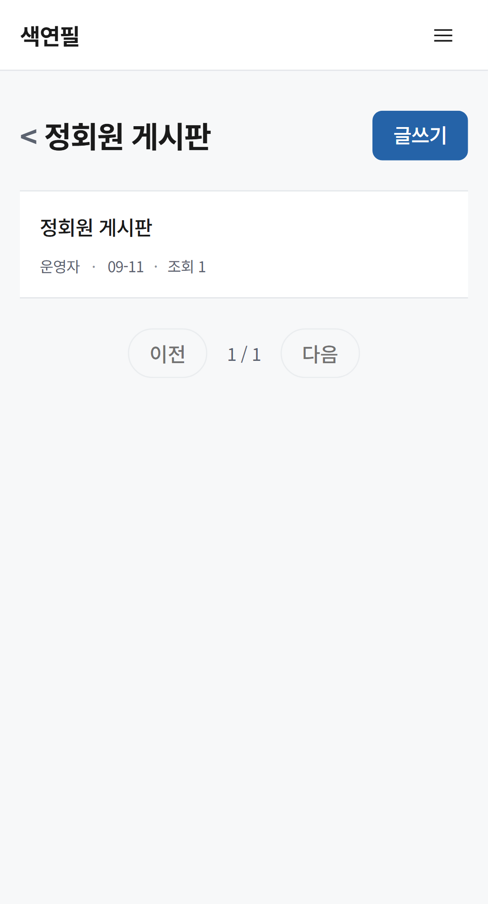

### S-04 게시글 작성·수정·삭제 — 글을 쓰면 목록과 상세에 나타난다 (통과)

**S-04 게시글 목록(작성 전)**

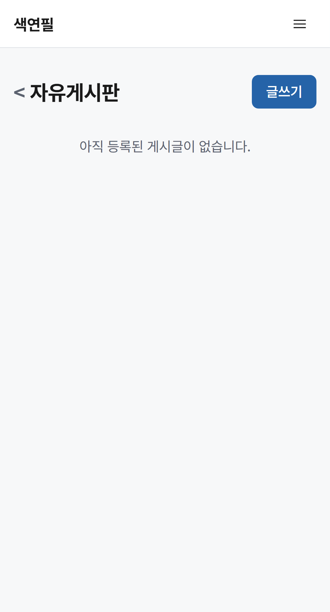

**S-04 글쓰기 폼 입력**

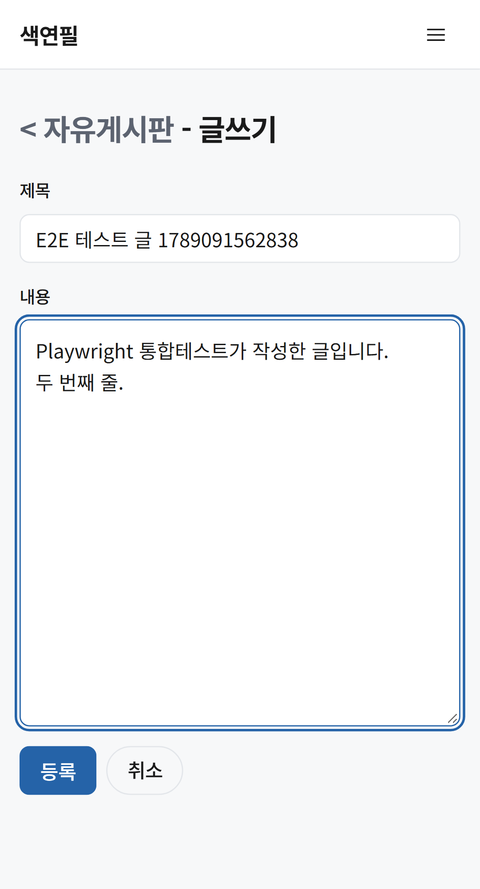

**S-04 게시글 상세 — 작성자에게 수정·삭제 버튼이 보인다**

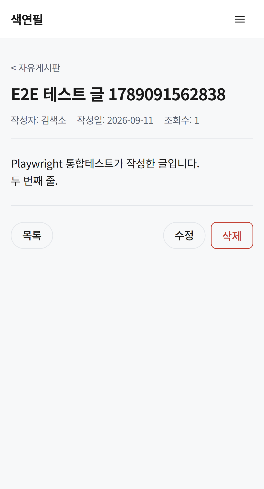

**S-04 게시글 목록 — 번호는 게시판 내 순번**

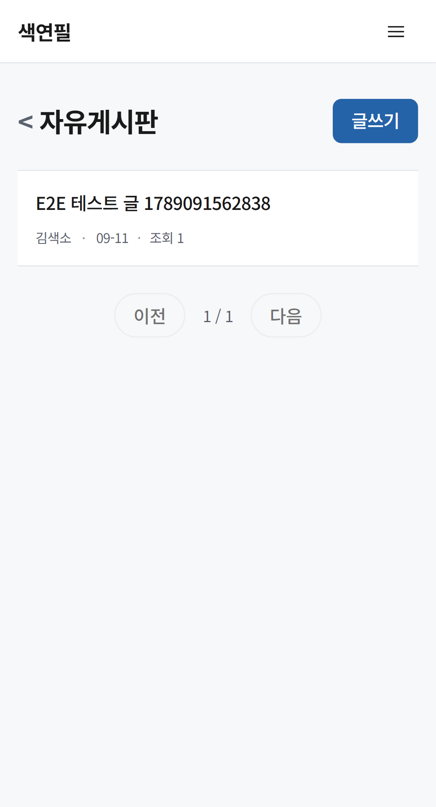

### S-04 게시글 작성·수정·삭제 — 본인 글을 수정한다 (통과)

**S-04 게시글 수정 완료 — 수정으로 조회수가 오르지 않는다**

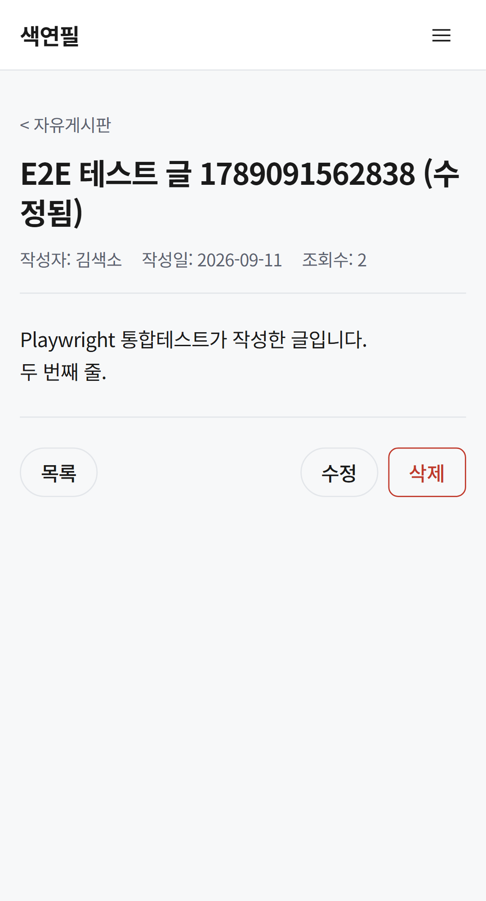

### S-04 게시글 작성·수정·삭제 — [엣지] 타인의 글에는 수정·삭제 버튼이 없다 (통과)

**[엣지] 타인 글 — 수정·삭제 버튼이 노출되지 않는다**

![[엣지] 타인 글 — 수정·삭제 버튼이 노출되지 않는다](./screenshots/28-post-other-owner.png)

### S-04 게시글 작성·수정·삭제 — 본인 글을 삭제하면 목록에서 사라진다 (통과)

**S-04 삭제 전 확인 — 브라우저 confirm 대신 화면에서 묻는다**

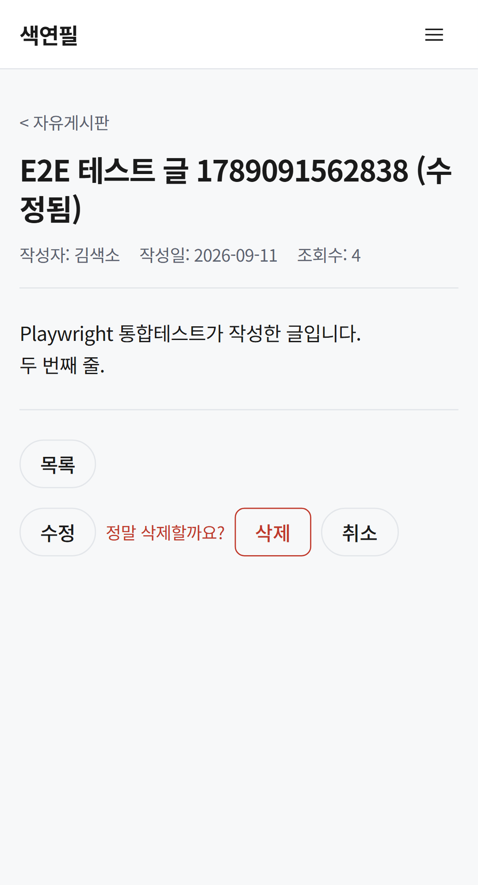

**S-04 삭제 후 목록에서 사라짐**

### S-04 게시글 작성·수정·삭제 — [엣지] 없는 글을 열면 오류를 안내한다 (통과)

**[엣지] 존재하지 않는 게시글 — 404 안내**

![[엣지] 존재하지 않는 게시글 — 404 안내](./screenshots/31-post-not-found.png)

### S-04 게시글 작성·수정·삭제 — [엣지] 없는 경로는 404 화면을 보여준다 (통과)

**[엣지] 정의되지 않은 경로 — 404 화면**

![[엣지] 정의되지 않은 경로 — 404 화면](./screenshots/32-not-found.png)

### S-05 예약현황 조회·신청 — 하루 예약현황이 30분 단위로 표시된다 (통과)

**S-05 하루 예약현황 — 30분 단위 슬롯 목록**

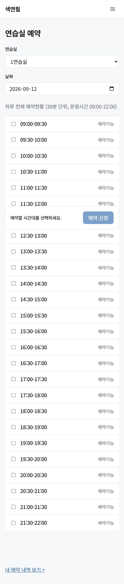

### S-05 예약현황 조회·신청 — 연속된 슬롯을 골라 예약한다 (통과)

**S-05 연속 슬롯 2개 선택 — 하단에 시작~종료와 슬롯 수 요약**

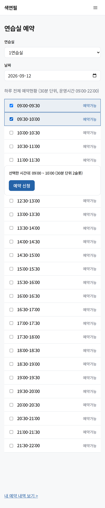

**S-05 예약 신청 확인 화면**

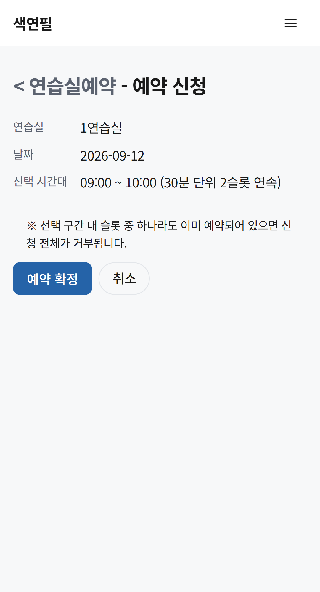

**S-05 예약 확정 — 현황으로 돌아와 성공 안내**

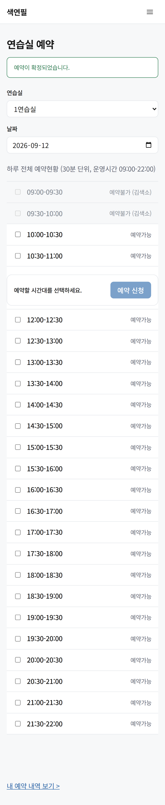

### S-05 예약현황 조회·신청 — [엣지] 비연속 슬롯을 고르면 안내하고 선택을 막는다 (통과)

**[엣지] 비연속 슬롯 선택 — 안내 후 선택 유지**

![[엣지] 비연속 슬롯 선택 — 안내 후 선택 유지](./screenshots/44-slots-noncontiguous.png)

### S-05 예약현황 조회·신청 — [엣지] 가운데 슬롯은 해제할 수 없다 (통과)

**[엣지] 가운데 슬롯 해제 시도 — 거절하고 3슬롯 유지**

![[엣지] 가운데 슬롯 해제 시도 — 거절하고 3슬롯 유지](./screenshots/45-slots-middle-release.png)

### S-05 예약현황 조회·신청 — [엣지] 이미 예약된 시간대는 고를 수 없다 (통과)

**[엣지] 타인이 예약한 슬롯 — 예약불가 표시와 선택 불가**

![[엣지] 타인이 예약한 슬롯 — 예약불가 표시와 선택 불가](./screenshots/46-slot-taken.png)

### S-05 예약현황 조회·신청 — [엣지] 화면이 낡아 이미 찬 구간을 신청하면 서버가 409로 거부한다 (통과)

**[엣지] 이미 찬 구간을 신청하는 화면(낡은 현황)**

![[엣지] 이미 찬 구간을 신청하는 화면(낡은 현황)](./screenshots/47a-reserve-stale.png)

**[엣지] 중복 예약 — 서버 409와 "최신 예약현황 보기" 안내**

![[엣지] 중복 예약 — 서버 409와 "최신 예약현황 보기" 안내](./screenshots/47-reserve-conflict.png)

### S-06 예약 취소 — 시작 전 예약을 취소하면 상태가 취소로 바뀐다 (통과)

**S-06 내 예약 내역 — 상태별 표시와 취소 버튼**

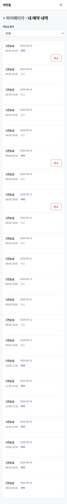

**S-06 취소 전 확인**

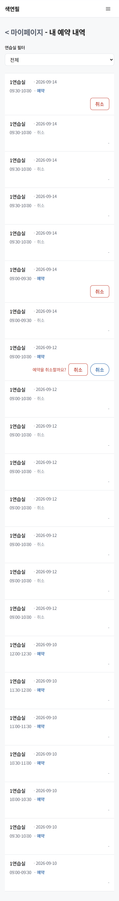

**S-06 취소 완료 — 상태가 "취소"로 바뀐다**

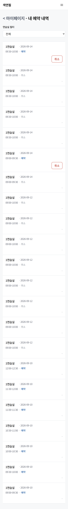

### S-06 예약 취소 — 연습실 필터로 예약을 걸러낸다 (통과)

**S-06 연습실 필터 — 선택이 주소에 남는다**

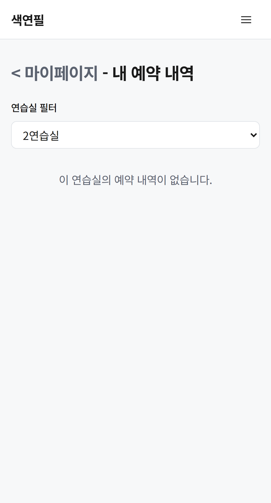

### S-06 예약 취소 — [엣지] 이미 시작된 예약에는 취소 버튼이 없다 (통과)

**[엣지·미구현] 지난 날짜 예약이 서버에서 그대로 만들어진다**

![[엣지·미구현] 지난 날짜 예약이 서버에서 그대로 만들어진다](./screenshots/54-past-date-reserved.png)

**[엣지] 시작된 예약 — 취소 버튼이 노출되지 않는다**

![[엣지] 시작된 예약 — 취소 버튼이 노출되지 않는다](./screenshots/55-past-no-cancel.png)

### S-07 회원 등급 변경 — 관리자에게만 [관리자] 메뉴가 보인다 (통과)

**S-07 관리자 입구 — 등급·게시판·연습실 관리로 가는 길**

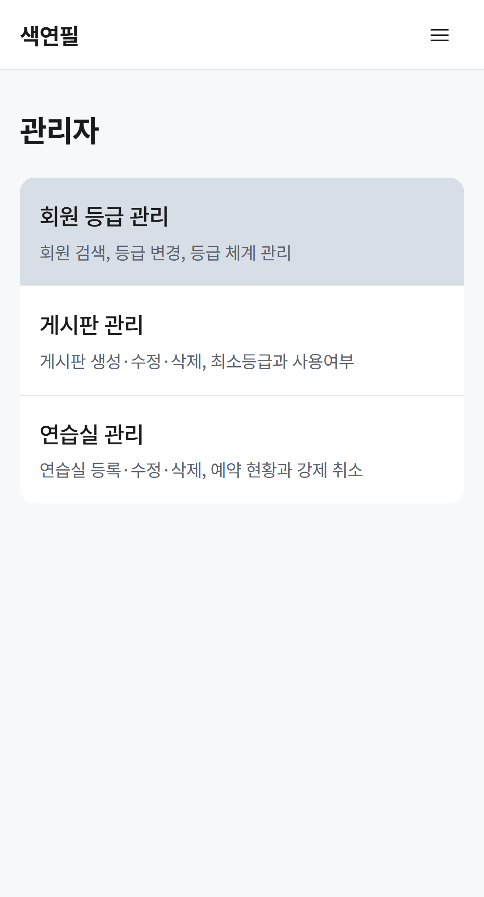

### S-07 회원 등급 변경 — 회원을 검색해 등급을 바꾼다 (통과)

**S-07 회원 검색 결과 — 현재 등급과 변경 드롭다운**

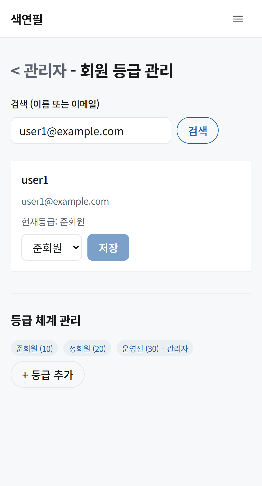

**S-07 등급 변경 성공 — 안내와 갱신된 등급이 함께 보인다**

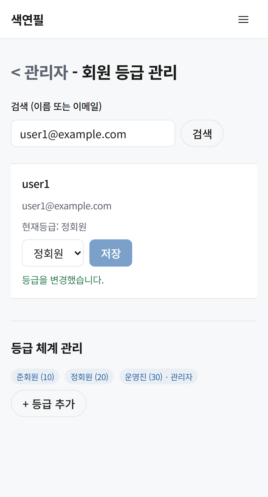

### S-07 회원 등급 변경 — 등급 체계가 서열 순으로 보인다 (통과)

**S-07 등급 체계 — 서열 순 나열, 운영진은 관리자 표시**

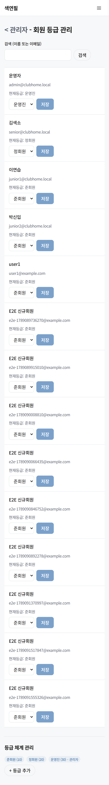

### S-07 회원 등급 변경 — [엣지] 비관리자는 관리자 화면에 들어갈 수 없다 (통과)

**[엣지] 준회원이 관리자 경로 진입 — 홈으로 돌려보낸다**

![[엣지] 준회원이 관리자 경로 진입 — 홈으로 돌려보낸다](./screenshots/64-admin-blocked.png)

### S-08 게시판·연습실 관리 — 게시판 목록에 비활성 게시판까지 보인다 (통과)

**S-08 게시판 관리 — 최소등급과 사용여부**

### S-08 게시판·연습실 관리 — 게시판을 생성하고 다시 삭제한다 (통과)

**S-08 게시판 생성 폼 — 모달이 아니라 인라인**

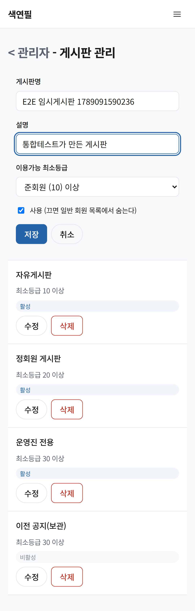

**S-08 게시판 생성 완료**

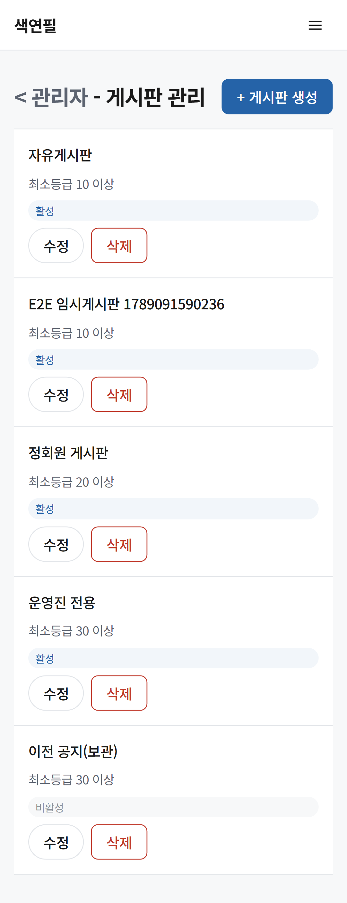

**S-08 게시판 삭제 완료**

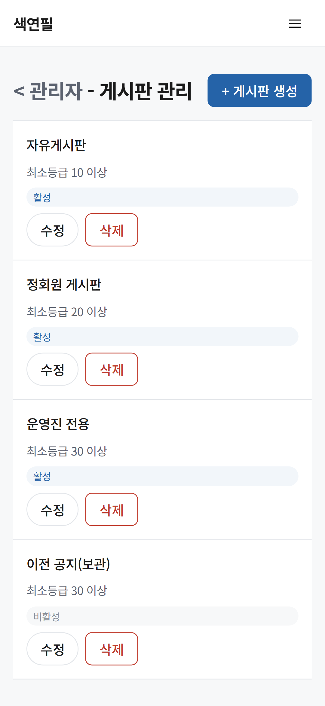

### S-08 게시판·연습실 관리 — [엣지] 게시글이 있는 게시판은 삭제가 거부된다 (통과)

**[엣지] 게시글이 있는 게시판 삭제 — 409와 대안 안내**

![[엣지] 게시글이 있는 게시판 삭제 — 409와 대안 안내](./screenshots/74-board-delete-denied.png)

### S-08 게시판·연습실 관리 — 연습실 관리 화면에서 예약 현황까지 본다 (통과)

**S-08 연습실 관리 — 같은 화면 아래에 예약 현황·내역 섹션**

### S-08 게시판·연습실 관리 — 관리자가 예약을 강제 취소한다 (통과)

**S-08 강제 취소 확인 — 관리자는 시작 여부와 무관하게 취소할 수 있다**

**S-08 강제 취소 완료**

### 모바일 - 공통 네비게이션 — 메뉴가 햄버거로 접히고 눌러서 펼친다 (통과)

**모바일 홈 — 메뉴가 햄버거(≡)로 접혀 있다**

**모바일 — 햄버거를 펼친 메뉴 시트**

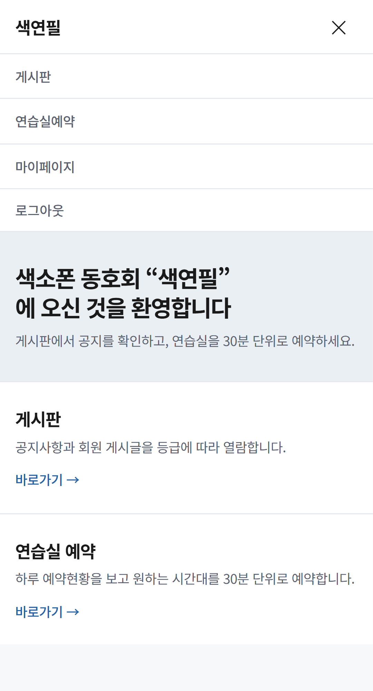

**모바일 — 메뉴 선택 후 시트가 닫힌다**

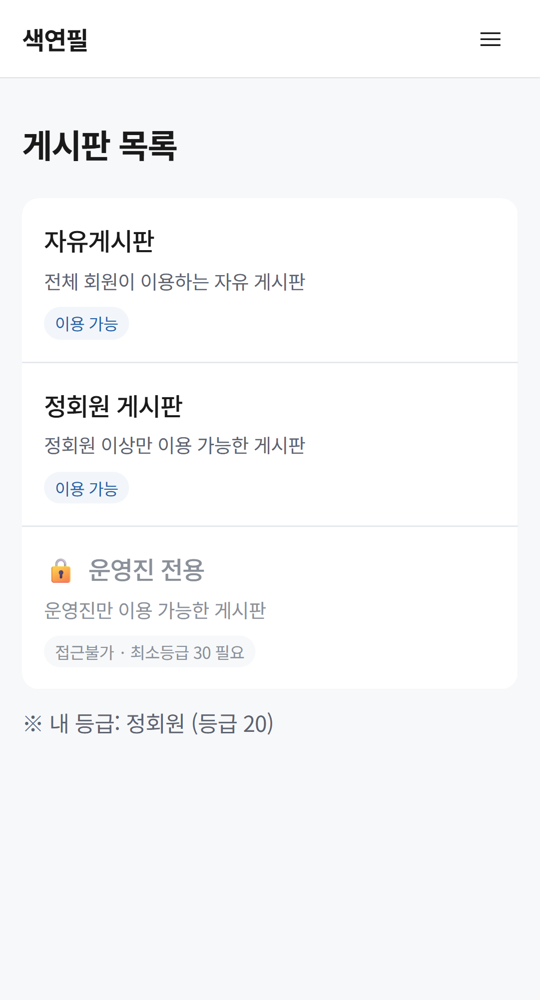

### 모바일 - 공통 네비게이션 — 관리자 메뉴도 시트 안에 들어간다 (통과)

**모바일 — 관리자 메뉴가 시트에 추가된다**

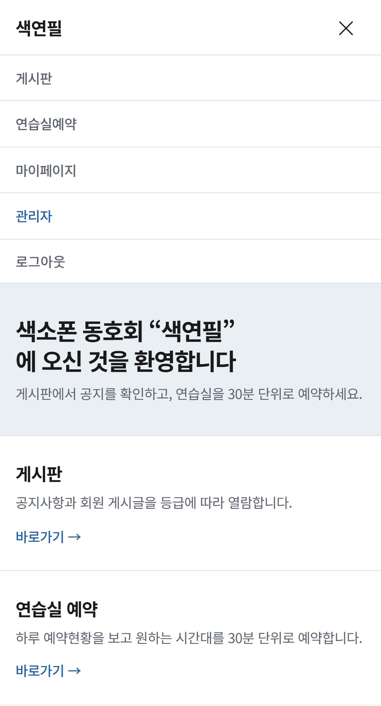

### 모바일 - 표에서 카드로 전환 — 게시글 목록이 카드 리스트로 보인다 (통과)

**모바일 게시글 목록 — 표 대신 카드, 열 제목은 숨김**

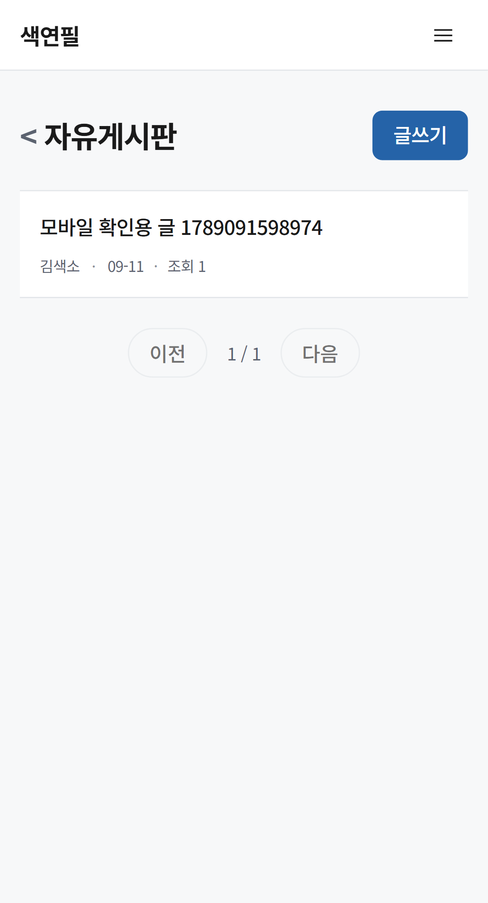

### 모바일 - 표에서 카드로 전환 — 내 예약 내역이 카드 리스트로 보인다 (통과)

**모바일 내 예약 내역 — 카드 리스트, 필터는 위쪽 드롭다운**

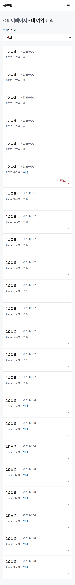

### 모바일 - 표에서 카드로 전환 — 예약현황의 선택 요약이 화면 하단에 붙어 따라온다 (통과)

**모바일 예약현황 — 스크롤해도 하단 요약·신청 버튼이 붙어 있다**

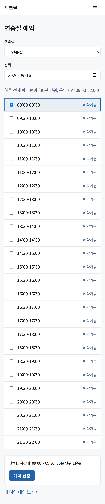

### 모바일 - 레이아웃 넘침 — 관리자 화면은 가로 스크롤을 자체 영역 안에서 처리한다 (통과)

**모바일 관리자 화면 — 문서는 가로로 밀리지 않는다**

### 모바일 - 주요 화면과 엣지케이스 — 폼 화면은 1열 그대로다 (통과)

**모바일 로그인 — 폼은 PC와 같은 1열 구성**

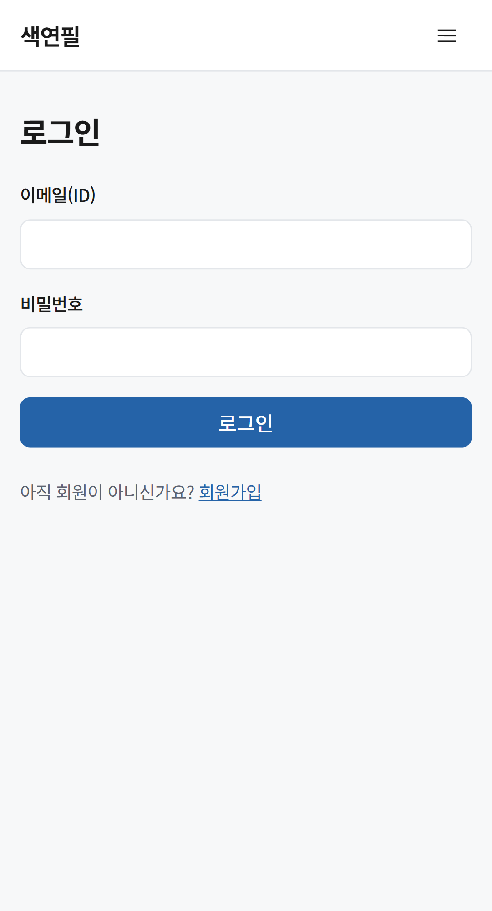

**모바일 회원가입**

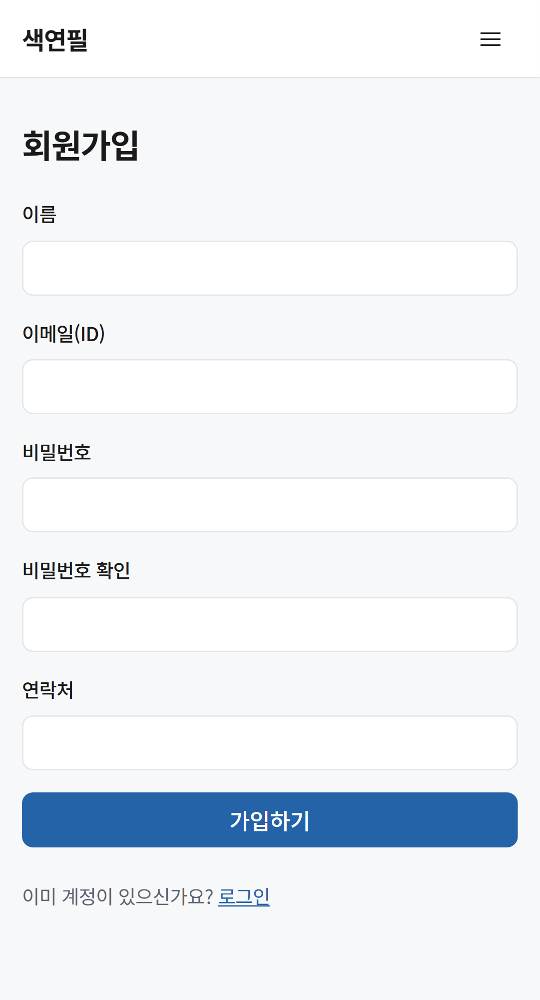

### 모바일 - 주요 화면과 엣지케이스 — 게시판 목록의 잠금 표시가 모바일에서도 읽힌다 (통과)

**모바일 게시판 목록 — 자물쇠와 "접근불가"가 줄바꿈되어도 읽힌다**

### 모바일 - 주요 화면과 엣지케이스 — [엣지] 등급 미달 게시판 거부 안내가 모바일에서도 보인다 (통과)

**[엣지] 모바일 — 등급 미달 게시판 거부 안내**

![[엣지] 모바일 — 등급 미달 게시판 거부 안내](./screenshots/91-forbidden-mobile.png)

### 모바일 - 주요 화면과 엣지케이스 — [엣지] 비연속 슬롯 안내가 모바일에서도 보인다 (통과)

**[엣지] 모바일 — 비연속 슬롯 선택 거절 안내**

![[엣지] 모바일 — 비연속 슬롯 선택 거절 안내](./screenshots/92-noncontiguous-mobile.png)

### 모바일 - 주요 화면과 엣지케이스 — [엣지] 모바일에서도 관리자 경로는 비관리자를 막는다 (통과)

**[엣지] 모바일 — 준회원의 관리자 경로 진입 차단**

![[엣지] 모바일 — 준회원의 관리자 경로 진입 차단](./screenshots/93-admin-blocked-mobile.png)
